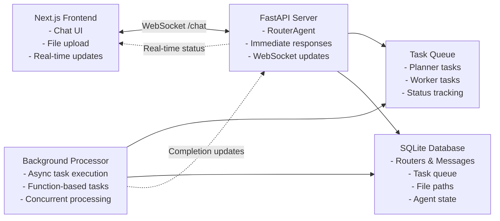
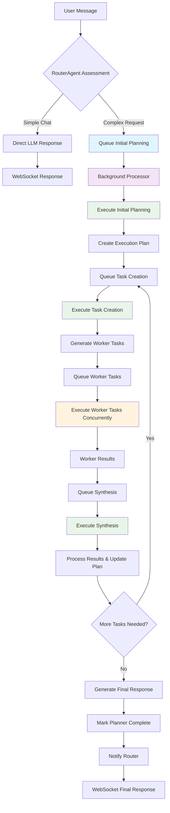
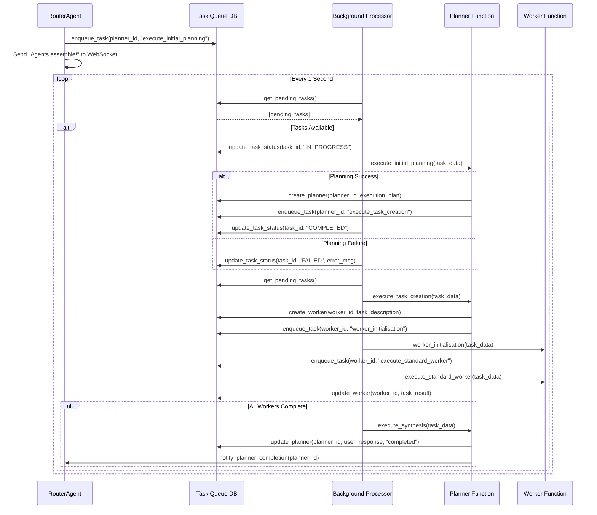
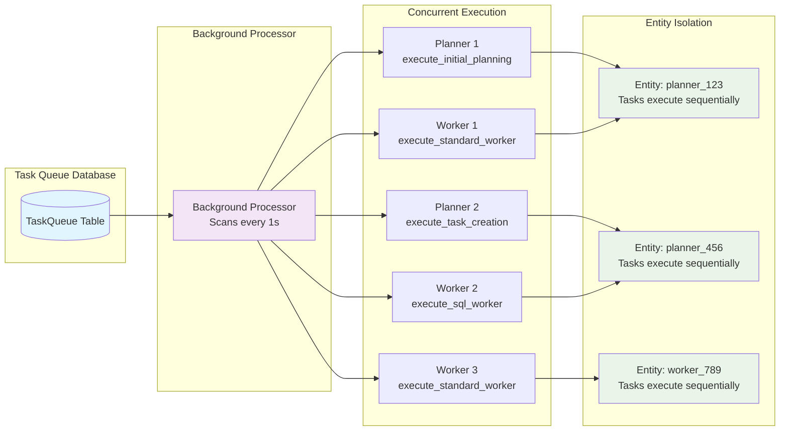
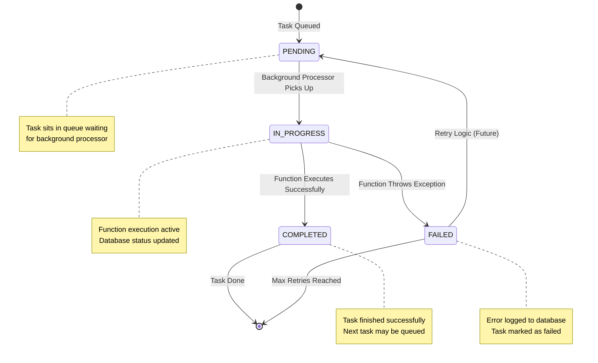
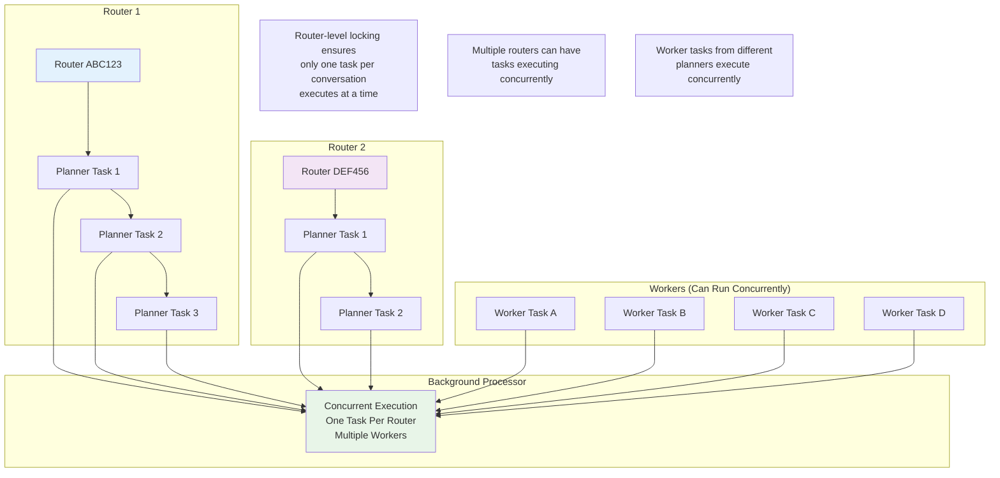

# Agent System Architecture

## Overview
Implementation of an AI agent system with real-time frontend interface using a modern function-based task queue architecture. The system features a router that handles normal chat interactions and automatically queues background agent tasks when complex processing is required (e.g., image analysis, multi-step tasks).

## System Architecture



## Core Components

### Frontend (Next.js)
- **Technology**: Next.js 15 with App Router, TypeScript
- **UI Framework**: shadcn/ui components with Tailwind CSS
- **Architecture**: 
  - Modular component design (6 focused components vs monolithic)
  - Error boundaries for fault tolerance
  - Mobile-first responsive design
  - Accessibility-first approach with ARIA labels
- **Features**: 
  - Real-time chat interface with semantic HTML
  - Intelligent file upload with duplicate detection
  - Drag-and-drop file capability with resolution dialogs
  - WebSocket connection for bidirectional communication
  - Router history and persistence
  - Auto-resizing input with keyboard shortcuts
  - Status indicators and loading states
- **State Management**: Zustand with TypeScript
- **Styling**: 
  - shadcn/ui component library
  - Tailwind CSS with CSS variables for theming
  - Dark/light mode support
  - Design token system

### Backend (FastAPI Server)
- **Technology**: FastAPI with WebSocket support and async task queue
- **Core Components**:
  - **RouterAgent**: WebSocket-enabled chat interface with immediate response capability
  - **Background Processor**: Continuous task processor that executes queued functions
  - **Task Queue System**: Database-backed queue for async function execution
  - **Function-Based Tasks**: 
    - Planner functions (planning, task creation, synthesis)
    - Worker functions (initialisation, execution, validation)
  - **File Storage System**: Organised file management with collision avoidance

### Database
- **Technology**: SQLite with comprehensive agent state management
- **Core Tables**: 
  - **Routers**: Conversation state and metadata
  - **Messages**: Router, planner, and worker message history
  - **Planners**: Planning agent state and execution plans
  - **Workers**: Worker agent state and task results
  - **TaskQueue**: Async function execution queue with status tracking
- **Advanced Features**:
  - JSON columns for file path storage (variable_file_paths, image_file_paths)
  - Task queue with entity-based organization
  - Collision avoidance for file naming
  - Agent state persistence and recovery
- **Scalability**: Can migrate to PostgreSQL for multi-user production deployment

## Agent Flow

### Simple Chat Mode (Default)
1. User sends message via WebSocket
2. RouterAgent processes immediately and responds
3. WebSocket delivers instant response
4. No background processing required
5. Maintains router history in database

### Complex Processing Mode (Triggered)
1. RouterAgent detects complex requirements:
   - File uploads (images, PDFs, CSVs)
   - Agent assistance needed (web search, analysis)
   - Multi-step processing requests
2. RouterAgent queues background task and responds "Agents assemble!"
3. Background processor picks up queued planner task
4. Function-based execution:
   - `execute_initial_planning`: Creates execution plan from user request
   - `execute_task_creation`: Generates worker tasks from plan
   - `execute_synthesis`: Processes worker results and updates plan
5. Worker functions execute individual tasks concurrently
6. Planner synthesis generates final user response
7. Router receives completion notification and delivers final response

## Task Queue Flow Diagrams

### Complete Task Execution Flow



### Task Queue Database Operations



### Concurrent Task Processing



### Task State Transitions



### Router-Level Task Locking



## Communication Protocols

### WebSocket (Primary)
- **Endpoint**: `/chat`
- **Purpose**: Real-time bidirectional communication
- **Features**: 
  - Instant messaging with router persistence
  - Status updates during processing
  - Automatic router history on connect
  - File-based analysis triggering

### HTTP REST (Secondary)
- **Purpose**: File uploads and router management
- **Endpoints**: 
  - `POST /upload` - File uploads
  - `GET /routers/{id}` - Router history
  - `GET /health` - Service status

## Key Features

### Function-Based Task Architecture
- Immediate HTTP responses with background processing
- Async task queue for scalable agent execution
- Concurrent processing of multiple agents and conversations
- Function-based design for improved maintainability and testability

### Intelligent Routing
- Automatic detection of simple chat vs complex analysis needs
- Immediate responses for simple queries
- Background task queueing for complex processing
- Real-time WebSocket status updates during background execution

### Multi-Modal Processing
- Image analysis and chart reading with file storage
- PDF document processing with text/image extraction
- CSV data analysis with SQL queries and DuckDB integration
- Organised file management with collision avoidance

### Advanced State Management
- Persistent router and agent state with SQLite database
- File path storage with JSON columns
- Task queue with status tracking and error handling
- Recovery mechanisms for failed tasks
- Cross-session state persistence and restoration

## Development Structure (Monorepo)

```
agent/
├── backend/
│   ├── src/agent/          # Agent system library
│   │   ├── core/           # RouterAgent (function-based)
│   │   ├── tasks/          # Async task functions
│   │   │   ├── planner_tasks.py    # Planning function library
│   │   │   ├── worker_tasks.py     # Worker function library
│   │   │   ├── file_manager.py     # File storage operations
│   │   │   └── task_utils.py       # Task queue utilities
│   │   ├── services/       # Background processor and LLM services
│   │   │   ├── background_processor.py  # Async task processor
│   │   │   ├── llm_service.py           # LLM integration
│   │   │   └── image_service.py         # Image processing
│   │   ├── models/         # Pydantic schemas and database models
│   │   │   ├── agent_database.py       # Database models and operations
│   │   │   ├── tasks.py                # Task-related models
│   │   │   └── responses.py            # Response models
│   │   ├── config/         # Configuration and settings
│   │   ├── utils/          # Utility functions and tools
│   │   └── security/       # Security and validation
│   ├── tests/              # Comprehensive test suite
│   │   ├── test_*.py       # Function-based testing
│   │   └── ...             # Organised by functionality
│   ├── main.py             # FastAPI server entry point
│   ├── pyproject.toml      # uv-managed dependencies
│   └── Dockerfile
├── frontend/
│   ├── src/
│   │   ├── app/            # Next.js App Router
│   │   ├── components/     # Modular React components
│   │   │   ├── ChatInterface.tsx    # Main orchestrator
│   │   │   ├── ChatHeader.tsx       # Header with connection status
│   │   │   ├── MessageList.tsx      # Message display and scrolling
│   │   │   ├── MessageInput.tsx     # Input with auto-resize
│   │   │   ├── FileAttachment.tsx   # File upload handling
│   │   │   └── ErrorBoundary.tsx    # Error handling component
│   │   ├── hooks/          # WebSocket and state hooks
│   │   ├── lib/            # Utility functions (cn helper)
│   │   └── stores/         # Zustand state management
│   ├── components.json     # shadcn/ui configuration
│   ├── tailwind.config.ts  # Tailwind with design tokens
│   ├── package.json
│   └── Dockerfile
├── shared/
│   └── types/              # Shared type definitions
├── docker-compose.yml      # Local development setup
├── ARCHITECTURE.md         # This file
└── README.md
```

## Technical Benefits

### Function-Based Architecture
- Immediate HTTP responses improve user experience
- Background task processing enables concurrent operations
- Function-based design improves testability and maintainability
- Async task queue supports scalable processing
- Separation of concerns between routing and processing

### Performance & Responsiveness
- Sub-100ms response times for simple chat interactions
- Non-blocking background processing for complex tasks
- Concurrent execution of multiple conversations
- Efficient task queue with database persistence
- Real-time WebSocket updates during background execution

### Scalability & Reliability
- Task queue enables horizontal scaling of background processors
- Database-backed state management ensures reliability
- Error handling and recovery mechanisms for failed tasks
- File storage system with collision avoidance
- Comprehensive test suite ensures system stability

### Developer Experience
- Function-based design simplifies testing and debugging
- Clear separation between immediate and background operations
- Type safety across frontend/backend with shared types
- Comprehensive test coverage for all major components
- Container-ready deployment with Docker
- uv-based dependency management for fast builds
- Modern development patterns throughout the stack

## Deployment Options

### Development
- `docker-compose up` for full stack
- Independent service development

### Production
- Container orchestration (Docker Swarm/Kubernetes)
- Separate database hosting if needed
- CDN for frontend static assets

## Future Enhancements

- Multi-user support with PostgreSQL migration
- Advanced router analytics
- Plugin system for additional agent capabilities
- Mobile-responsive PWA features