# Agent System Architecture

## Overview
Implementation of an AI agent system with real-time frontend interface using a modern function-based task queue architecture. The system features function-based router operations that handle normal chat interactions and automatically queue background agent tasks when complex processing is required (e.g., image analysis, multi-step tasks).

## System Architecture

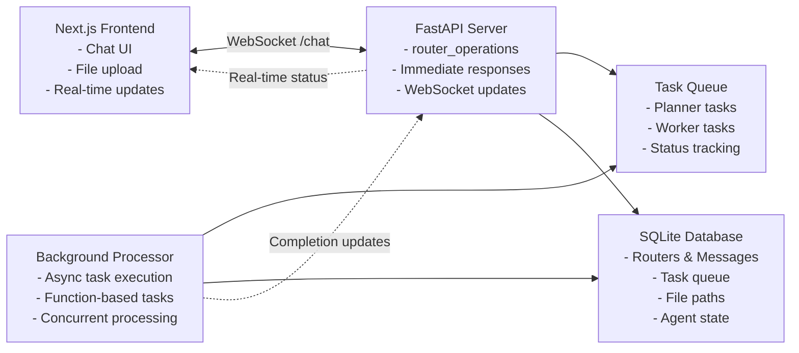
```mermaid
graph LR
    A[Next.js Frontend<br/>- Chat UI<br/>- File upload<br/>- Real-time updates] 
    B[FastAPI Server<br/>- router_operations<br/>- Immediate responses<br/>- WebSocket updates]
    C[Background Processor<br/>- Async task execution<br/>- Function-based tasks<br/>- Concurrent processing]
    D[Task Queue<br/>- Planner tasks<br/>- Worker tasks<br/>- Status tracking]
    E[SQLite Database<br/>- Routers & Messages<br/>- Task queue<br/>- File paths<br/>- Agent state]
    
    A <-->|"WebSocket /chat"| B
    B --> D
    C --> D
    C --> E
    B --> E
    C -.->|"Completion updates"| B
    B -.->|"Real-time status"| A
```

## Core Components

### Frontend (Next.js)
- **Technology**: Next.js 15 with App Router, TypeScript
- **UI Framework**: shadcn/ui components with Tailwind CSS
- **Architecture**: 
  - Modular component design (6 focused components vs monolithic)
  - Error boundaries for fault tolerance
  - Mobile-first responsive design
  - Accessibility-first approach with ARIA labels
- **Features**: 
  - Real-time chat interface with semantic HTML
  - Intelligent file upload with duplicate detection
  - Drag-and-drop file capability with resolution dialogs
  - WebSocket connection for bidirectional communication
  - Router history and persistence
  - Auto-resizing input with keyboard shortcuts
  - Status indicators and loading states
- **State Management**: Zustand with TypeScript
- **Styling**: 
  - shadcn/ui component library
  - Tailwind CSS with CSS variables for theming
  - Dark/light mode support
  - Design token system

### Backend (FastAPI Server)
- **Technology**: FastAPI with WebSocket support and async task queue
- **Core Components**:
  - **router_operations**: Function-based WebSocket chat interface with immediate response capability
  - **Background Processor**: Continuous task processor that executes queued functions
  - **Task Queue System**: Database-backed queue for async function execution
  - **Function-Based Tasks**: 
    - Planner functions (planning, task creation, synthesis)
    - Worker functions (initialisation, execution, validation)
  - **File Storage System**: Organised file management with collision avoidance

### Database
- **Technology**: SQLite with comprehensive agent state management
- **Core Tables**: 
  - **Routers**: Conversation state and metadata
  - **Messages**: Router, planner, and worker message history
  - **Planners**: Planning agent state and execution plans
  - **Workers**: Worker agent state and task results
  - **TaskQueue**: Async function execution queue with status tracking
- **Advanced Features**:
  - JSON columns for file path storage (variable_file_paths, image_file_paths)
  - Task queue with entity-based organization
  - Collision avoidance for file naming
  - Agent state persistence and recovery
- **Scalability**: Can migrate to PostgreSQL for multi-user production deployment

## Agent Flow

### Simple Chat Mode (Default)
1. User sends message via WebSocket
2. Router functions process immediately and respond
3. WebSocket delivers instant response
4. No background processing required
5. Maintains router history in database

### Complex Processing Mode (Triggered)
1. Router functions detect complex requirements:
   - File uploads (images, PDFs, CSVs)
   - Agent assistance needed (web search, analysis)
   - Multi-step processing requests
2. Router functions queue background task and respond "Agents assemble!"
3. Background processor picks up queued planner task
4. Function-based execution:
   - `execute_initial_planning`: Creates execution plan from user request
   - `execute_task_creation`: Generates worker tasks from plan
   - `execute_synthesis`: Processes worker results and updates plan
5. Worker functions execute individual tasks concurrently
6. Planner synthesis generates final user response
7. Router receives completion notification and delivers final response

## Task Queue Flow Diagrams

### Complete Task Execution Flow

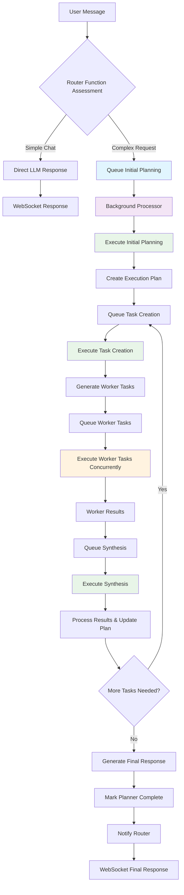
```mermaid
graph TD
    A[User Message] --> B{Router Function Assessment}
    B -->|Simple Chat| C[Direct LLM Response]
    B -->|Complex Request| D[Queue Initial Planning]
    
    C --> E[WebSocket Response]
    
    D --> F[Background Processor]
    F --> G[Execute Initial Planning]
    G --> H[Create Execution Plan]
    H --> I[Queue Task Creation]
    
    I --> J[Execute Task Creation]
    J --> K[Generate Worker Tasks]
    K --> L[Queue Worker Tasks]
    
    L --> M[Execute Worker Tasks Concurrently]
    M --> N[Worker Results]
    N --> O[Queue Synthesis]
    
    O --> P[Execute Synthesis]
    P --> Q[Process Results & Update Plan]
    Q --> R{More Tasks Needed?}
    
    R -->|Yes| I
    R -->|No| S[Generate Final Response]
    S --> T[Mark Planner Complete]
    T --> U[Notify Router]
    U --> V[WebSocket Final Response]
    
    style D fill:#e1f5fe
    style F fill:#f3e5f5
    style G fill:#e8f5e8
    style J fill:#e8f5e8
    style M fill:#fff3e0
    style P fill:#e8f5e8
```

### Task Queue Database Operations

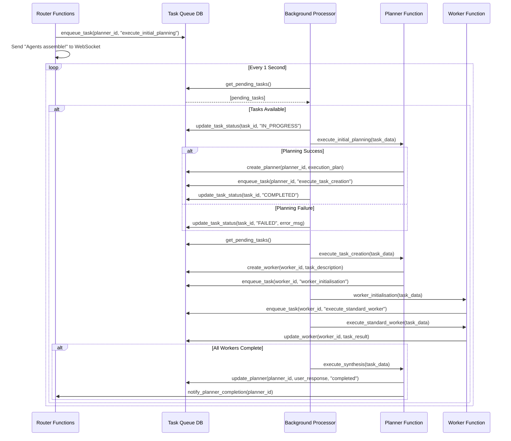
```mermaid
sequenceDiagram
    participant R as Router Functions
    participant DB as Task Queue DB
    participant BP as Background Processor
    participant PF as Planner Function
    participant WF as Worker Function
    
    R->>DB: enqueue_task(planner_id, "execute_initial_planning")
    R->>R: Send "Agents assemble!" to WebSocket
    
    loop Every 1 Second
        BP->>DB: get_pending_tasks()
        DB-->>BP: [pending_tasks]
        
        alt Tasks Available
            BP->>DB: update_task_status(task_id, "IN_PROGRESS")
            BP->>PF: execute_initial_planning(task_data)
            
            alt Planning Success
                PF->>DB: create_planner(planner_id, execution_plan)
                PF->>DB: enqueue_task(planner_id, "execute_task_creation")
                BP->>DB: update_task_status(task_id, "COMPLETED")
            else Planning Failure
                BP->>DB: update_task_status(task_id, "FAILED", error_msg)
            end
            
            BP->>DB: get_pending_tasks()
            BP->>PF: execute_task_creation(task_data)
            
            PF->>DB: create_worker(worker_id, task_description)
            PF->>DB: enqueue_task(worker_id, "worker_initialisation")
            
            BP->>WF: worker_initialisation(task_data)
            WF->>DB: enqueue_task(worker_id, "execute_standard_worker")
            
            BP->>WF: execute_standard_worker(task_data)
            WF->>DB: update_worker(worker_id, task_result)
            
            alt All Workers Complete
                BP->>PF: execute_synthesis(task_data)
                PF->>DB: update_planner(planner_id, user_response, "completed")
                PF->>R: notify_planner_completion(planner_id)
            end
        end
    end
```

### Concurrent Task Processing

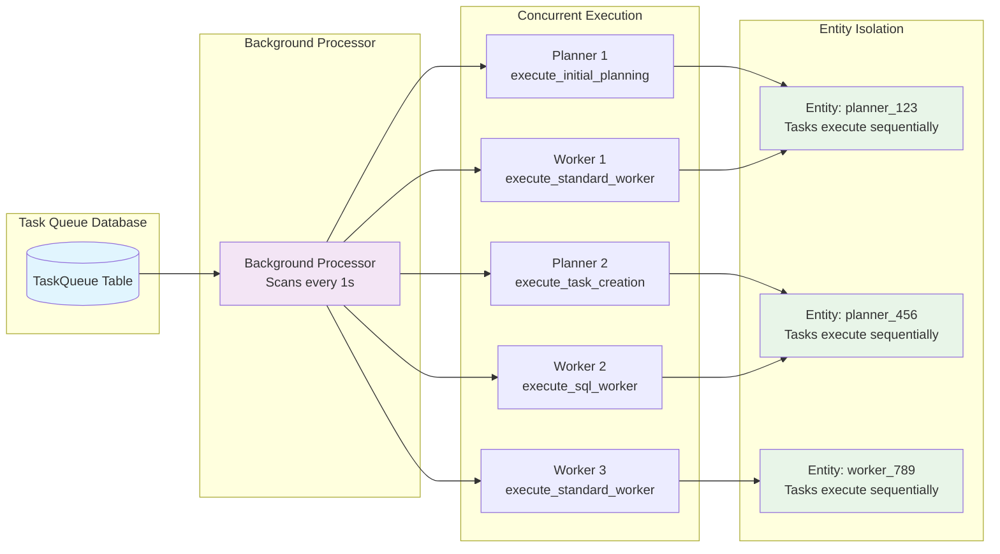
```mermaid
graph LR
    subgraph "Task Queue Database"
        Q[(TaskQueue Table)]
    end
    
    subgraph "Background Processor"
        BP[Background Processor<br/>Scans every 1s]
    end
    
    subgraph "Concurrent Execution"
        P1[Planner 1<br/>execute_initial_planning]
        P2[Planner 2<br/>execute_task_creation] 
        W1[Worker 1<br/>execute_standard_worker]
        W2[Worker 2<br/>execute_sql_worker]
        W3[Worker 3<br/>execute_standard_worker]
    end
    
    subgraph "Entity Isolation"
        E1[Entity: planner_123<br/>Tasks execute sequentially]
        E2[Entity: planner_456<br/>Tasks execute sequentially]
        E3[Entity: worker_789<br/>Tasks execute sequentially]
    end
    
    Q --> BP
    BP --> P1
    BP --> P2
    BP --> W1
    BP --> W2
    BP --> W3
    
    P1 --> E1
    P2 --> E2
    W1 --> E1
    W2 --> E2
    W3 --> E3
    
    style Q fill:#e1f5fe
    style BP fill:#f3e5f5
    style E1 fill:#e8f5e8
    style E2 fill:#e8f5e8
    style E3 fill:#e8f5e8
```

### Task State Transitions

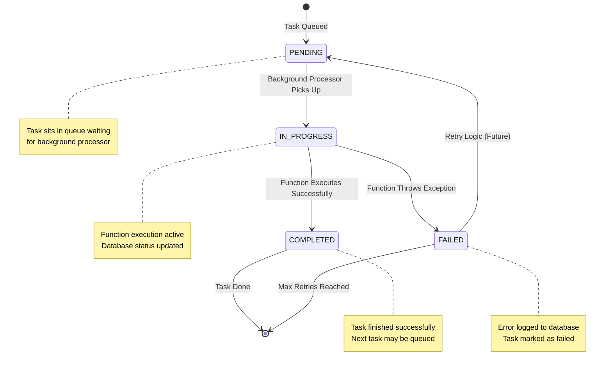
```mermaid
stateDiagram-v2
    [*] --> PENDING: Task Queued
    PENDING --> IN_PROGRESS: Background Processor Picks Up
    IN_PROGRESS --> COMPLETED: Function Executes Successfully
    IN_PROGRESS --> FAILED: Function Throws Exception
    
    COMPLETED --> [*]: Task Done
    FAILED --> PENDING: Retry Logic (Future)
    FAILED --> [*]: Max Retries Reached
    
    note right of PENDING
        Task sits in queue waiting
        for background processor
    end note
    
    note right of IN_PROGRESS
        Function execution active
        Database status updated
    end note
    
    note right of COMPLETED
        Task finished successfully
        Next task may be queued
    end note
    
    note right of FAILED
        Error logged to database
        Task marked as failed
    end note
```

### Router-Level Task Locking

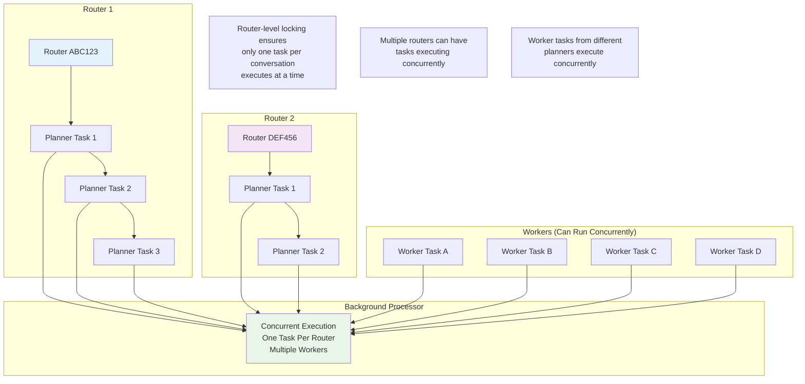
```mermaid
graph TD
    subgraph "Router 1"
        R1[Router ABC123]
        R1 --> R1_P1[Planner Task 1]
        R1_P1 --> R1_P2[Planner Task 2]
        R1_P2 --> R1_P3[Planner Task 3]
    end
    
    subgraph "Router 2"
        R2[Router DEF456]
        R2 --> R2_P1[Planner Task 1]
        R2_P1 --> R2_P2[Planner Task 2]
    end
    
    subgraph "Workers (Can Run Concurrently)"
        W1[Worker Task A]
        W2[Worker Task B]
        W3[Worker Task C]
        W4[Worker Task D]
    end
    
    subgraph "Background Processor"
        BP[Concurrent Execution<br/>One Task Per Router<br/>Multiple Workers]
    end
    
    R1_P1 --> BP
    R1_P2 --> BP
    R1_P3 --> BP
    R2_P1 --> BP
    R2_P2 --> BP
    
    W1 --> BP
    W2 --> BP
    W3 --> BP
    W4 --> BP
    
    style R1 fill:#e3f2fd
    style R2 fill:#f3e5f5
    style BP fill:#e8f5e8
    
    note1[Router-level locking ensures<br/>only one task per conversation<br/>executes at a time]
    note2[Multiple routers can have<br/>tasks executing concurrently]
    note3[Worker tasks from different<br/>planners execute concurrently]
```

## Communication Protocols

### WebSocket (Primary)
- **Endpoint**: `/chat`
- **Purpose**: Real-time bidirectional communication
- **Features**: 
  - Instant messaging with router persistence
  - Status updates during processing
  - Automatic router history on connect
  - File-based analysis triggering

### HTTP REST (Secondary)
- **Purpose**: File uploads and router management
- **Endpoints**: 
  - `POST /upload` - File uploads
  - `GET /routers/{id}` - Router history
  - `GET /health` - Service status

## Key Features

### Function-Based Task Architecture
- Immediate HTTP responses with background processing
- Async task queue for scalable agent execution
- Concurrent processing of multiple agents and conversations
- Function-based design for improved maintainability and testability

### Intelligent Routing
- Automatic detection of simple chat vs complex analysis needs
- Immediate responses for simple queries
- Background task queueing for complex processing
- Real-time WebSocket status updates during background execution

### Multi-Modal Processing
- Image analysis and chart reading with file storage
- PDF document processing with text/image extraction
- CSV data analysis with SQL queries and DuckDB integration
- Organised file management with collision avoidance

### Advanced State Management
- Persistent router and agent state with SQLite database
- File path storage with JSON columns
- Task queue with status tracking and error handling
- Recovery mechanisms for failed tasks
- Cross-session state persistence and restoration

## Model Context Protocol (MCP) Architecture

### Overview
MCP provides a standardised protocol for the agent system to connect to and use external tools from any compatible server. This enables extensibility without modifying core agent code.

### Architecture Components

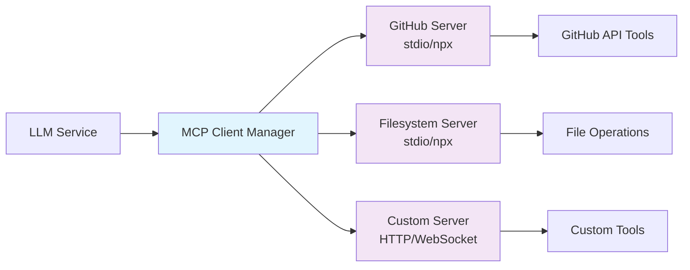
```mermaid
graph LR
    A[LLM Service] --> B[MCP Client Manager]
    B --> C[GitHub Server<br/>stdio/npx]
    B --> D[Filesystem Server<br/>stdio/npx]  
    B --> E[Custom Server<br/>HTTP/WebSocket]
    
    C --> F[GitHub API Tools]
    D --> G[File Operations]
    E --> H[Custom Tools]
    
    style B fill:#e1f5fe
    style C fill:#f3e5f5
    style D fill:#f3e5f5
    style E fill:#f3e5f5
```

### MCP Integration Flow

1. **Server Connection**: MCP servers are configured via environment variables or YAML
2. **Tool Discovery**: On connection, the MCP manager discovers all available tools
3. **LLM Integration**: Tools are formatted as OpenAI function calling schema
4. **Tool Execution**: When LLM requests a tool, MCP manager executes it on the appropriate server
5. **Result Handling**: Tool results are returned to LLM for processing

### Transport Layers

**Stdio Transport** (Node.js packages):
- Spawns Node.js subprocess with npx command
- Communicates via stdin/stdout
- Examples: `@modelcontextprotocol/server-github`, `@modelcontextprotocol/server-filesystem`
- Persistent connection maintained throughout application lifecycle

**HTTP Transport**:
- RESTful API endpoints for tool discovery and execution
- Stateless request/response model
- Suitable for cloud-hosted tool servers

**WebSocket Transport**:
- Bidirectional communication for real-time tools
- Persistent connection with automatic reconnection
- Ideal for streaming data or long-running operations

### Security & Configuration

**Security Boundaries**:
- Filesystem server restricted to specific directories (`/app/files/uploads`)
- GitHub server requires personal access token with appropriate scopes
- Per-agent MCP enablement (router, planner, workers can be configured separately)

**Configuration System** (backend/src/agent/config/mcp_config.py):
- Environment-first configuration approach
- Optional YAML configuration for complex setups
- Automatic environment variable substitution in YAML
- Server-specific environment variables (e.g., `GITHUB_PERSONAL_ACCESS_TOKEN`)

### External Tool Ecosystem

**Available Tool Servers**:
- **GitHub**: Issues, PRs, repositories, gists, workflow management
- **Filesystem**: Secure read/write operations within allowed directories
- **Custom Servers**: Any MCP-compatible server via published npm packages or HTTP endpoints

**Tool Naming Convention**:
- Tools prefixed with server name to avoid conflicts
- Format: `{server}__{tool}` (e.g., `github__create_issue`)
- Automatic prefixing handled by MCP manager

## Development Structure (Monorepo)

```
agent/
├── backend/
│   ├── src/agent/          # Agent system library
│   │   ├── core/           # router_operations (standalone functions)
│   │   ├── tasks/          # Async task functions
│   │   │   ├── planner_tasks.py    # Planning function library
│   │   │   ├── worker_tasks.py     # Worker function library
│   │   │   ├── file_manager.py     # File storage operations
│   │   │   └── task_utils.py       # Task queue utilities
│   │   ├── services/       # Background processor and LLM services
│   │   │   ├── background_processor.py  # Async task processor
│   │   │   ├── llm_service.py           # LLM integration
│   │   │   └── image_service.py         # Image processing
│   │   ├── models/         # Pydantic schemas and database models
│   │   │   ├── agent_database.py       # Database models and operations
│   │   │   ├── tasks.py                # Task-related models
│   │   │   └── responses.py            # Response models
│   │   ├── config/         # Configuration and settings
│   │   ├── utils/          # Utility functions and tools
│   │   └── security/       # Security and validation
│   ├── tests/              # Comprehensive test suite
│   │   ├── test_*.py       # Function-based testing
│   │   └── ...             # Organised by functionality
│   ├── main.py             # FastAPI server entry point
│   ├── pyproject.toml      # uv-managed dependencies
│   └── Dockerfile
├── frontend/
│   ├── src/
│   │   ├── app/            # Next.js App Router
│   │   ├── components/     # Modular React components
│   │   │   ├── ChatInterface.tsx    # Main orchestrator
│   │   │   ├── ChatHeader.tsx       # Header with connection status
│   │   │   ├── MessageList.tsx      # Message display and scrolling
│   │   │   ├── MessageInput.tsx     # Input with auto-resize
│   │   │   ├── FileAttachment.tsx   # File upload handling
│   │   │   └── ErrorBoundary.tsx    # Error handling component
│   │   ├── hooks/          # WebSocket and state hooks
│   │   ├── lib/            # Utility functions (cn helper)
│   │   └── stores/         # Zustand state management
│   ├── components.json     # shadcn/ui configuration
│   ├── tailwind.config.ts  # Tailwind with design tokens
│   ├── package.json
│   └── Dockerfile
├── shared/
│   └── types/              # Shared type definitions
├── docker-compose.yml      # Local development setup
├── ARCHITECTURE.md         # This file
└── README.md
```

## Testing Architecture

The Agent System implements a comprehensive **six-layer async/await validation strategy** to prevent runtime errors before they reach production. This testing harness ensures async correctness throughout the development lifecycle.

### Multi-Layer Testing Strategy

```mermaid
graph TD
    subgraph "Layer 1: Static Analysis (0.1-5s)"
        SA1[check_async.py]
        SA2[Ruff ASYNC rules]
        SA3[MyPy coroutine checking]
        SA4[IDE integration]
    end
    
    subgraph "Layer 2: Runtime Warning Tests (5-15s)"
        RT1[async_test_utils.py]
        RT2[Enhanced unit tests]
        RT3[@async_warning_test decorator]
        RT4[In-memory database testing]
    end
    
    subgraph "Layer 3: Pre-commit Hooks (30-60s)"
        PC1[.pre-commit-config.yaml]
        PC2[setup_hooks.py installer]
        PC3[Automatic git validation]
        PC4[Commit blocking]
    end
    
    subgraph "Layer 4: Hybrid Mocking (2-3s)"
        HM1[test_hybrid_async_execution.py]
        HM2[Real async internal functions]
        HM3[Mock external services]
        HM4[Performance benchmarking]
    end
    
    subgraph "Layer 5: Integration Tests (<2min)"
        IT1[test_lightweight_async_flows.py]
        IT2[test_agent_activation_e2e.py]
        IT3[test_concurrent_async_operations.py]
        IT4[test_websocket_async_communication.py]
    end
    
    subgraph "Layer 6: End-to-End Validation (<3min)"
        E2E1[test_end_to_end_async_prevention.py]
        E2E2[Multi-layer effectiveness validation]
        E2E3[Performance profiling & optimization]
        E2E4[Success metrics collection]
    end
    
    DEV[Developer Workflow] --> SA1
    SA1 --> RT1
    RT1 --> PC1
    PC1 --> IT1
    IT1 --> E2E1
    
    SA1 --> SA2
    SA2 --> SA3
    SA3 --> SA4
    
    RT1 --> RT2
    RT2 --> RT3
    RT3 --> RT4
    
    PC1 --> PC2
    PC2 --> PC3
    PC3 --> PC4
    
    IT1 --> IT2
    IT2 --> IT3
    IT3 --> IT4
    
    style SA1 fill:#e1f5fe
    style RT1 fill:#f3e5f5
    style PC1 fill:#fff3e0
    style IT1 fill:#e8f5e8
```

### Testing Component Architecture

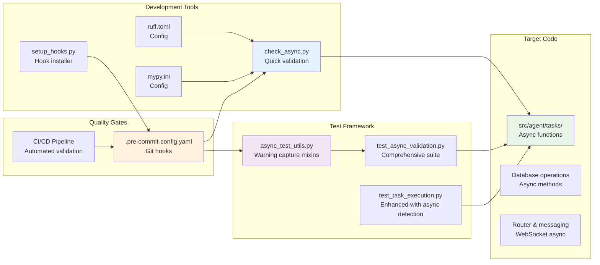
```mermaid
graph LR
    subgraph "Development Tools"
        CA[check_async.py<br/>Quick validation]
        SH[setup_hooks.py<br/>Hook installer]
        RU[ruff.toml<br/>Config]
        MY[mypy.ini<br/>Config]
    end
    
    subgraph "Test Framework"
        ATU[async_test_utils.py<br/>Warning capture mixins]
        TAV[test_async_validation.py<br/>Comprehensive suite]
        TTE[test_task_execution.py<br/>Enhanced with async detection]
    end
    
    subgraph "Quality Gates"
        PC[.pre-commit-config.yaml<br/>Git hooks]
        CI[CI/CD Pipeline<br/>Automated validation]
    end
    
    subgraph "Target Code"
        TC[src/agent/tasks/<br/>Async functions]
        DB[Database operations<br/>Async methods]
        RT[Router & messaging<br/>WebSocket async]
    end
    
    CA --> TC
    ATU --> TAV
    TAV --> TC
    TTE --> TC
    PC --> CA
    PC --> ATU
    CI --> PC
    
    SH --> PC
    RU --> CA
    MY --> CA
    
    style CA fill:#e3f2fd
    style ATU fill:#f3e5f5
    style PC fill:#fff3e0
    style TC fill:#e8f5e8
```

### Error Detection Flow

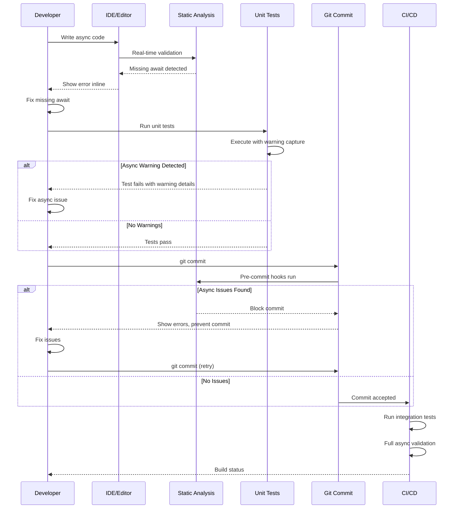
```mermaid
sequenceDiagram
    participant DEV as Developer
    participant IDE as IDE/Editor
    participant SA as Static Analysis
    participant UT as Unit Tests
    participant GIT as Git Commit
    participant CI as CI/CD
    
    DEV->>IDE: Write async code
    IDE->>SA: Real-time validation
    SA-->>IDE: Missing await detected
    IDE-->>DEV: Show error inline
    
    DEV->>DEV: Fix missing await
    DEV->>UT: Run unit tests
    UT->>UT: Execute with warning capture
    
    alt Async Warning Detected
        UT-->>DEV: Test fails with warning details
        DEV->>DEV: Fix async issue
    else No Warnings
        UT-->>DEV: Tests pass
    end
    
    DEV->>GIT: git commit
    GIT->>SA: Pre-commit hooks run
    
    alt Async Issues Found
        SA-->>GIT: Block commit
        GIT-->>DEV: Show errors, prevent commit
        DEV->>DEV: Fix issues
        DEV->>GIT: git commit (retry)
    else No Issues
        GIT->>CI: Commit accepted
    end
    
    CI->>CI: Run integration tests
    CI->>CI: Full async validation
    CI-->>DEV: Build status
```

### Test Coverage Matrix

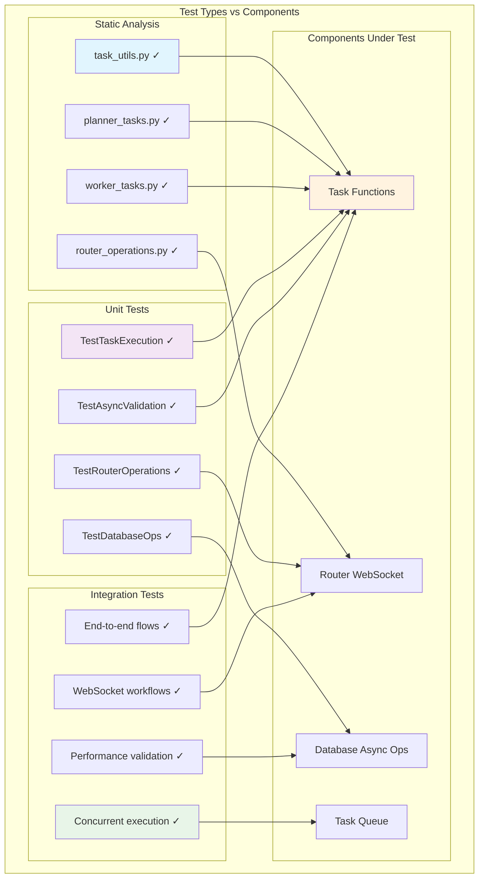
```mermaid
graph TD
    subgraph "Test Types vs Components"
        subgraph "Static Analysis"
            SA_T[task_utils.py ✓]
            SA_P[planner_tasks.py ✓]
            SA_W[worker_tasks.py ✓]
            SA_R[router_operations.py ✓]
        end
        
        subgraph "Unit Tests"
            UT_T[TestTaskExecution ✓]
            UT_A[TestAsyncValidation ✓]
            UT_D[TestDatabaseOps ✓]
            UT_R[TestRouterOperations ✓]
        end
        
        subgraph "Integration Tests"
            IT_C[Concurrent execution ✓]
            IT_E[End-to-end flows ✓]
            IT_P[Performance validation ✓]
            IT_W[WebSocket workflows ✓]
        end
        
        subgraph "Components Under Test"
            COMP_T[Task Functions]
            COMP_D[Database Async Ops]
            COMP_R[Router WebSocket]
            COMP_Q[Task Queue]
        end
    end
    
    SA_T --> COMP_T
    SA_P --> COMP_T
    SA_W --> COMP_T
    SA_R --> COMP_R
    
    UT_T --> COMP_T
    UT_A --> COMP_T
    UT_D --> COMP_D
    UT_R --> COMP_R
    
    IT_C --> COMP_Q
    IT_E --> COMP_T
    IT_P --> COMP_D
    IT_W --> COMP_R
    
    style SA_T fill:#e1f5fe
    style UT_T fill:#f3e5f5
    style IT_C fill:#e8f5e8
    style COMP_T fill:#fff3e0
```

### Async Testing Utilities Architecture

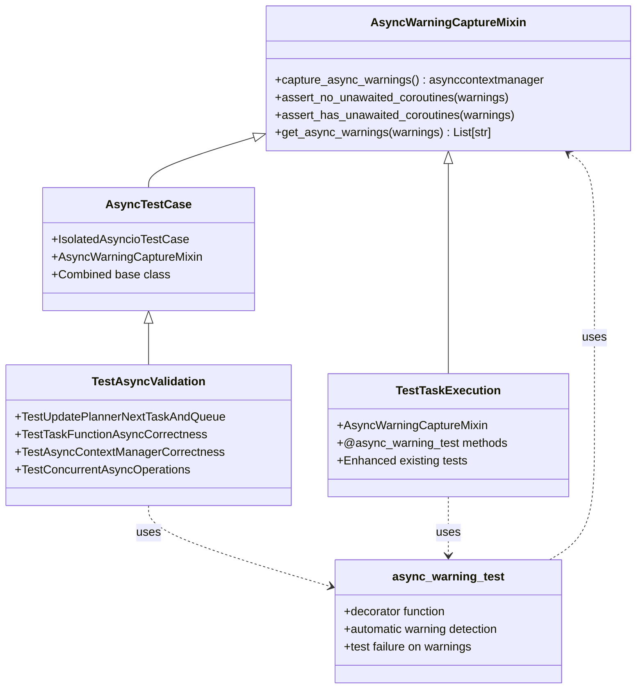
```mermaid
classDiagram
    class AsyncWarningCaptureMixin {
        +capture_async_warnings() asynccontextmanager
        +assert_no_unawaited_coroutines(warnings)
        +assert_has_unawaited_coroutines(warnings)
        +get_async_warnings(warnings) List[str]
    }
    
    class async_warning_test {
        +decorator function
        +automatic warning detection
        +test failure on warnings
    }
    
    class AsyncTestCase {
        +IsolatedAsyncioTestCase
        +AsyncWarningCaptureMixin
        +Combined base class
    }
    
    class TestAsyncValidation {
        +TestUpdatePlannerNextTaskAndQueue
        +TestTaskFunctionAsyncCorrectness  
        +TestAsyncContextManagerCorrectness
        +TestConcurrentAsyncOperations
    }
    
    class TestTaskExecution {
        +AsyncWarningCaptureMixin
        +@async_warning_test methods
        +Enhanced existing tests
    }
    
    AsyncWarningCaptureMixin <|-- AsyncTestCase
    AsyncTestCase <|-- TestAsyncValidation
    AsyncWarningCaptureMixin <|-- TestTaskExecution
    async_warning_test ..> AsyncWarningCaptureMixin : uses
    TestAsyncValidation ..> async_warning_test : uses
    TestTaskExecution ..> async_warning_test : uses
```

### Development Workflow Integration

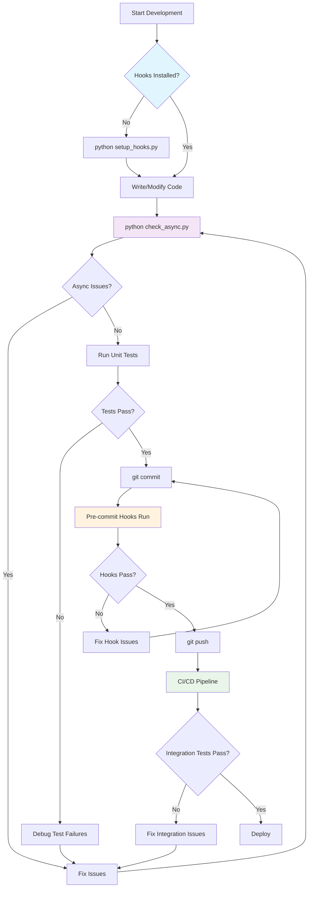
```mermaid
flowchart TD
    START[Start Development] --> SETUP{Hooks Installed?}
    SETUP -->|No| INSTALL[python setup_hooks.py]
    SETUP -->|Yes| CODE[Write/Modify Code]
    INSTALL --> CODE
    
    CODE --> CHECK[python check_async.py]
    CHECK --> ISSUES{Async Issues?}
    
    ISSUES -->|Yes| FIX[Fix Issues]
    FIX --> CHECK
    ISSUES -->|No| TEST[Run Unit Tests]
    
    TEST --> TRESULT{Tests Pass?}
    TRESULT -->|No| DEBUG[Debug Test Failures]
    DEBUG --> FIX
    TRESULT -->|Yes| COMMIT[git commit]
    
    COMMIT --> HOOKS[Pre-commit Hooks Run]
    HOOKS --> HRESULT{Hooks Pass?}
    
    HRESULT -->|No| HFIX[Fix Hook Issues]
    HFIX --> COMMIT
    HRESULT -->|Yes| PUSH[git push]
    
    PUSH --> CI[CI/CD Pipeline]
    CI --> CRESULT{Integration Tests Pass?}
    
    CRESULT -->|No| CIFIX[Fix Integration Issues]
    CIFIX --> FIX
    CRESULT -->|Yes| DEPLOY[Deploy]
    
    style SETUP fill:#e1f5fe
    style CHECK fill:#f3e5f5
    style HOOKS fill:#fff3e0
    style CI fill:#e8f5e8
```

### Performance Characteristics

| Layer | Target Time | Coverage | Error Types Caught |
|-------|------------|----------|-------------------|
| **Static Analysis** | <5 seconds | Syntax + Types | Missing awaits, blocking calls |
| **Runtime Warnings** | <15 seconds | Function execution | Unawaited coroutines |
| **Pre-commit Hooks** | <60 seconds | All validation | Complete async validation |
| **Hybrid Mocking Tests** | 2-3 seconds | Real async execution | Internal async path issues |
| **Integration Tests** | <2 minutes | System workflows | System-level async issues |

### Key Testing Innovations

1. **Hybrid Mocking Strategy**: Mock external services (LLMs, file I/O) but use real implementations for internal async functions
2. **Warning Capture System**: Runtime detection of `was never awaited` warnings during test execution  
3. **Automatic Quality Gates**: Pre-commit hooks block commits containing async issues
4. **Multi-Layer Validation**: Six complementary layers catch different types of async problems
5. **Phase 4 Integration Innovation**: System-level async validation with race condition detection and performance regression monitoring
6. **Phase 6 Effectiveness Validation**: End-to-end proof that all layers work together to prevent async bugs
7. **Developer-Friendly Tools**: Quick validation scripts and clear error messages with fix suggestions

### Test File Organization

```
tests/
├── async_test_utils.py              # Core testing utilities
├── unit/
│   ├── test_async_validation.py     # Comprehensive async testing
│   ├── test_hybrid_async_execution.py # Advanced hybrid mocking + performance
│   ├── test_task_execution.py       # Enhanced with async warnings
│   ├── test_database_operations.py  # Database async methods
│   └── test_router_operations.py   # WebSocket async operations
├── integration/
│   ├── test_concurrent_planner_execution.py  # Concurrency testing
│   ├── test_websocket_updates_execution.py   # Real-time communication
│   │
│   │ Phase 4: Enhanced Integration Testing for Real Async Execution
│   ├── test_lightweight_async_flows.py       # Critical async paths (30s)
│   ├── test_agent_activation_e2e.py          # Agent activation E2E (35s)
│   ├── test_concurrent_async_operations.py   # Concurrent validation (45s)
│   └── test_websocket_async_communication.py # WebSocket async flows (40s)
├── validation/
│   │ Phase 6: End-to-End Validation & Performance Optimization
│   └── test_end_to_end_async_prevention.py   # Complete multi-layer validation (60s)
└── run_*.py                         # Test runners with performance tracking
```

This testing architecture ensures that async/await correctness is validated at every stage of development, preventing the original `update_planner_next_task_and_queue` type of bug from ever reaching production.

## Technical Benefits

### Function-Based Architecture
- Immediate HTTP responses improve user experience
- Background task processing enables concurrent operations
- Function-based design improves testability and maintainability
- Async task queue supports scalable processing
- Separation of concerns between routing and processing

### Performance & Responsiveness
- Sub-100ms response times for simple chat interactions
- Non-blocking background processing for complex tasks
- Concurrent execution of multiple conversations
- Efficient task queue with database persistence
- Real-time WebSocket updates during background execution

### Scalability & Reliability
- Task queue enables horizontal scaling of background processors
- Database-backed state management ensures reliability
- Error handling and recovery mechanisms for failed tasks
- File storage system with collision avoidance
- Comprehensive test suite ensures system stability

### Developer Experience
- Function-based design simplifies testing and debugging
- Clear separation between immediate and background operations
- Type safety across frontend/backend with shared types
- Comprehensive test coverage for all major components
- Container-ready deployment with Docker
- uv-based dependency management for fast builds
- Modern development patterns throughout the stack

## Deployment Options

### Development
- `docker-compose up` for full stack
- Independent service development

### Production
- Container orchestration (Docker Swarm/Kubernetes)
- Separate database hosting if needed
- CDN for frontend static assets

## Future Enhancements

- Multi-user support with PostgreSQL migration
- Advanced router analytics
- Plugin system for additional agent capabilities
- Mobile-responsive PWA features