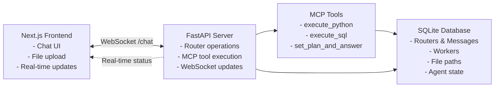
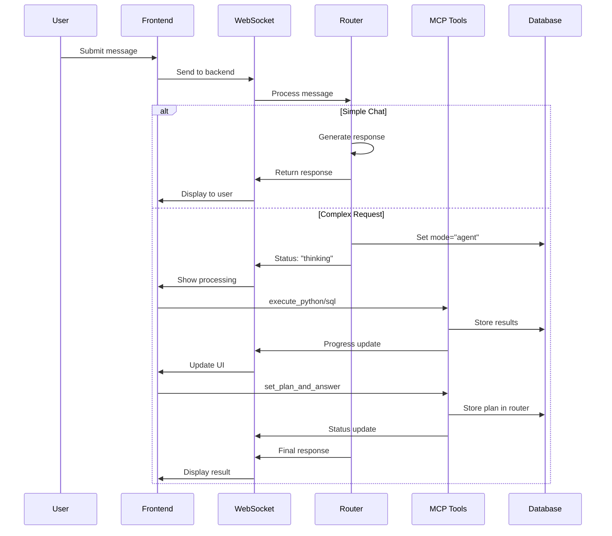
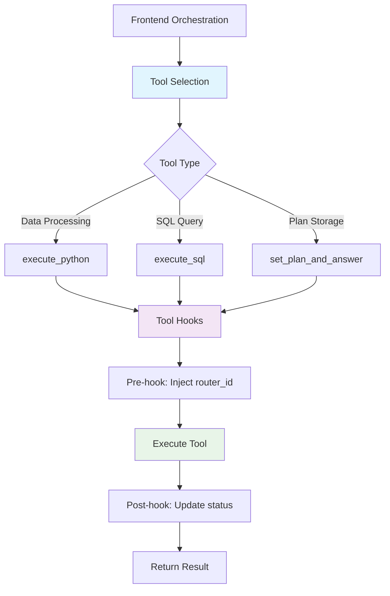
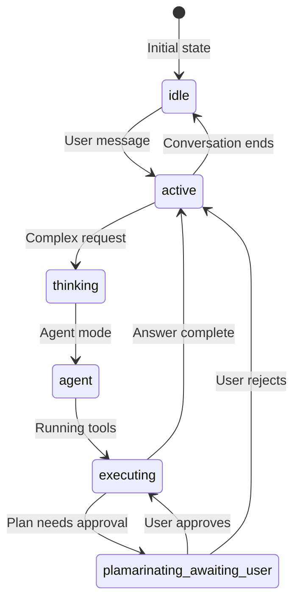

# Agent System Architecture

## Overview
Implementation of an AI agent system with real-time frontend interface using frontend-orchestrated synchronous execution. The system features WebSocket-based communication where the frontend controls task sequencing and execution flow, with the router handling all operations directly through MCP (Model Context Protocol) tools.

## System Architecture


```mermaid
graph LR
    A[Next.js Frontend<br/>- Chat UI<br/>- File upload<br/>- Real-time updates]
    B[FastAPI Server<br/>- Router operations<br/>- MCP tool execution<br/>- WebSocket updates]
    C[MCP Tools<br/>- execute_python<br/>- execute_sql<br/>- set_plan_and_answer]
    D[SQLite Database<br/>- Routers & Messages<br/>- Workers<br/>- File paths<br/>- Agent state]

    A <-->|"WebSocket /chat"| B
    B --> C
    C --> D
    B --> D
    B -.->|"Real-time status"| A
```

## Core Components

### Frontend (Next.js)
- **Technology**: Next.js 15 with App Router, TypeScript
- **UI Framework**: shadcn/ui components with Tailwind CSS
- **Architecture**:
  - Modular component design (6 focused components vs monolithic)
  - Error boundaries for fault tolerance
  - Mobile-first responsive design
  - Accessibility-first approach with ARIA labels
- **Features**:
  - Real-time chat interface with semantic HTML
  - Intelligent file upload with duplicate detection
  - Drag-and-drop file capability with resolution dialogs
  - WebSocket connection for bidirectional communication
  - Router history and persistence
  - Auto-resizing input with keyboard shortcuts
  - Status indicators and loading states
- **State Management**: Zustand with TypeScript
- **Styling**:
  - shadcn/ui component library
  - Tailwind CSS with CSS variables for theming
  - Dark/light mode support
  - Design token system

### Backend (FastAPI Server)
- **Technology**: FastAPI with WebSocket support and synchronous execution
- **Core Components**:
  - **Router Operations**: WebSocket chat interface with direct MCP tool execution
  - **MCP Tool System**: Direct execution of Python, SQL, and plan storage operations
  - **Tool Hooks**: Pre/post processing for context injection and status updates
  - **File Storage System**: Organised file management with collision avoidance
  - **Worker Management**: Synchronous worker execution with task validation

### Database
- **Technology**: SQLite with comprehensive agent state management
- **Core Tables**:
  - **Routers**: Conversation state, execution plans, and metadata
  - **Messages**: Router and worker message history (planner tables deprecated)
  - **Workers**: Worker agent state and task results
  - **System Instructions**: Per-router and per-worker custom instructions
- **Key Changes**:
  - Router table now stores execution_plan directly
  - TaskQueue table removed (no longer used)
  - Planner tables commented out (obsolete)
- **Scalability**: Can migrate to PostgreSQL for multi-user production deployment

## Agent Flow

### Simple Chat Mode (Default)
1. User sends message via WebSocket
2. Router processes immediately and responds
3. WebSocket delivers instant response
4. No complex processing required
5. Maintains router history in database

### Agent Mode (Complex Processing)
1. Router detects complex requirements:
   - File uploads (images, PDFs, CSVs)
   - Agent assistance needed (web search, analysis)
   - Multi-step processing requests
2. Router transitions to "agent" mode
3. Frontend orchestrates execution:
   - Calls appropriate MCP tools
   - Manages execution sequencing
   - Handles status updates
4. Tools execute synchronously:
   - `execute_python`: Runs Python code for analysis
   - `execute_sql`: Executes SQL queries on data
   - `set_plan_and_answer`: Stores execution plans and answers
5. Router stores results and updates status
6. Final response delivered via WebSocket

## Frontend-Orchestrated Execution Flow


```mermaid
sequenceDiagram
    participant U as User
    participant F as Frontend
    participant W as WebSocket
    participant R as Router
    participant T as MCP Tools
    participant D as Database

    U->>F: Submit message
    F->>W: Send to backend
    W->>R: Process message

    alt Simple Chat
        R->>R: Generate response
        R->>W: Return response
        W->>F: Display to user
    else Complex Request
        R->>D: Set mode="agent"
        R->>W: Status: "thinking"
        W->>F: Show processing

        F->>T: execute_python/sql
        T->>D: Store results
        T->>W: Progress update
        W->>F: Update UI

        F->>T: set_plan_and_answer
        T->>D: Store plan in router
        T->>W: Status update

        R->>W: Final response
        W->>F: Display result
    end
```

## MCP Tool Architecture

### Tool System Overview
MCP tools provide the primary execution mechanism for the agent system, replacing the old background processor architecture.


```mermaid
graph TD
    A[Frontend Orchestration] --> B[Tool Selection]
    B --> C{Tool Type}
    C -->|Data Processing| D[execute_python]
    C -->|SQL Query| E[execute_sql]
    C -->|Plan Storage| F[set_plan_and_answer]

    D --> G[Tool Hooks]
    E --> G
    F --> G

    G --> H[Pre-hook: Inject router_id]
    H --> I[Execute Tool]
    I --> J[Post-hook: Update status]
    J --> K[Return Result]

    style B fill:#e1f5fe
    style G fill:#f3e5f5
    style I fill:#e8f5e8
```

### Tool Hooks System
- **Pre-hooks**: Inject context (router_id) before tool execution
- **Post-hooks**: Handle status updates and WebSocket notifications
- **Registered hooks**:
  - `set_plan_and_answer`: Updates router status based on plan content
  - `execute_python/sql`: Injects router context for execution

### Status Flow


```mermaid
stateDiagram-v2
    [*] --> idle: Initial state
    idle --> active: User message
    active --> thinking: Complex request
    thinking --> agent: Agent mode
    agent --> executing: Running tools
    executing --> plamarinating_awaiting_user: Plan needs approval
    executing --> active: Answer complete
    plamarinating_awaiting_user --> executing: User approves
    plamarinating_awaiting_user --> active: User rejects
    active --> idle: Conversation ends
```

## Database Schema Changes

### Router Table Evolution
```sql
-- New fields in Router table
execution_plan TEXT,  -- Stores plan directly (no planner reference)
mode VARCHAR(50),     -- "auto" or "agent"
agent_phase VARCHAR(50), -- Current execution phase
```

### Deprecated Tables (Commented Out)
- `TaskQueue` - No longer needed without background processor
- `Planner` - Router handles plans directly
- `PlannerMessage` - Unified into router messages
- `PlannerMessageContent` - Content stored in router
- `PlannerSystemInstructions` - Instructions at router level

## Communication Protocols

### WebSocket (Primary)
- **Endpoint**: `/chat`
- **Purpose**: Real-time bidirectional communication
- **Message Types**:
  - Chat messages
  - Status updates
  - Mode changes
  - Tool execution requests
  - Progress notifications

### HTTP REST (Secondary)
- **Purpose**: File uploads and router management
- **Endpoints**:
  - `POST /upload` - File uploads
  - `GET /routers/{id}` - Router history
  - `GET /health` - Service status
  - ~~`GET /messages/{id}/planner-info`~~ - REMOVED

## Key Architectural Changes

### Before (Background Processor)
```
User → Router → Task Queue → Background Processor → Planner → Workers
```

### After (Frontend Orchestration)
```
User → Router → MCP Tools → Direct Execution
```

### Benefits of New Architecture
1. **Simpler**: No task queue or background processor complexity
2. **Synchronous**: Easier to debug and trace execution
3. **Real-time**: Immediate feedback through WebSocket
4. **Maintainable**: Fewer moving parts and clearer flow
5. **Reliable**: No async/await issues or task queue failures

## Development Structure (Monorepo)

```
agent/
├── backend/
│   ├── src/agent/          # Agent system library
│   │   ├── core/           # Router operations
│   │   ├── tasks/          # Worker tasks (planner tasks deprecated)
│   │   │   ├── worker_tasks.py     # Worker execution
│   │   │   └── file_manager.py     # File storage operations
│   │   ├── services/       # LLM and MCP services
│   │   │   ├── llm/
│   │   │   │   ├── llm_service.py  # LLM integration
│   │   │   │   ├── mcp_manager.py  # MCP tool management
│   │   │   │   ├── agent_tools.py  # Tool definitions
│   │   │   │   └── tool_hooks.py   # Pre/post processing
│   │   │   └── image_service.py    # Image processing
│   │   ├── models/         # Pydantic schemas and database models
│   │   │   ├── agent_database.py   # Database models and operations
│   │   │   ├── tasks.py            # Task-related models
│   │   │   └── responses.py        # Response models
│   │   ├── config/         # Configuration and settings
│   │   ├── utils/          # Utility functions and tools
│   │   └── security/       # Security and validation
│   ├── tests/              # Comprehensive test suite
│   ├── main.py             # FastAPI server entry point
│   ├── pyproject.toml      # uv-managed dependencies
│   └── Dockerfile
├── frontend/
│   ├── src/
│   │   ├── app/            # Next.js App Router
│   │   ├── components/     # React components
│   │   │   ├── ChatInterface.tsx    # Main orchestrator
│   │   │   ├── MessageList.tsx      # Message display
│   │   │   └── MessageInput.tsx     # Input handling
│   │   ├── hooks/          # WebSocket hooks
│   │   └── stores/         # Zustand state management
│   ├── package.json
│   └── Dockerfile
├── shared/
│   └── types/              # Shared type definitions
├── docker-compose.yml      # Local development setup
├── ARCHITECTURE.md         # This file
└── README.md
```

## Testing Architecture

The testing strategy has been simplified with the removal of async task queue complexity:

### Testing Layers
1. **Unit Tests**: Direct function testing without async complexity
2. **Integration Tests**: WebSocket and MCP tool integration
3. **End-to-End Tests**: Full flow validation

### Removed Testing Complexity
- No async/await validation needed for task queues
- No background processor timing issues
- No planner state synchronisation tests
- Simplified to synchronous execution paths

## Model Context Protocol (MCP) Integration

### MCP Tool Servers
The system can connect to external MCP servers for additional capabilities:

- **GitHub Server**: Issue and PR management
- **Filesystem Server**: Secure file operations
- **Custom Servers**: Extensible tool ecosystem

### Security
- Filesystem operations restricted to allowed directories
- GitHub operations require authentication tokens
- Tool execution controlled by hooks system

## Migration Path

### From Old to New Architecture
1. **Phase 1-4**: Initial restructuring (completed)
2. **Phase 5**: MCP tool implementation (completed)
3. **Phase 6**: Worker restructuring (completed)
4. **Phase 7**: Cleanup of obsolete code (completed)

### Database Migration
- Planner tables remain but unused
- New conversations use router-based execution
- Legacy data accessible but not modified

## Performance Characteristics

### Response Times
- Simple chat: <100ms
- Tool execution: 1-5 seconds per tool
- Complex workflows: 10-30 seconds total

### Scalability
- Vertical scaling for single-user deployment
- Horizontal scaling possible with PostgreSQL
- WebSocket connections scale with server resources

## Future Enhancements

- Multi-user support with PostgreSQL migration
- Enhanced execution plan UI
- Additional MCP tool servers
- Performance optimisation for large workflows
- Mobile application development