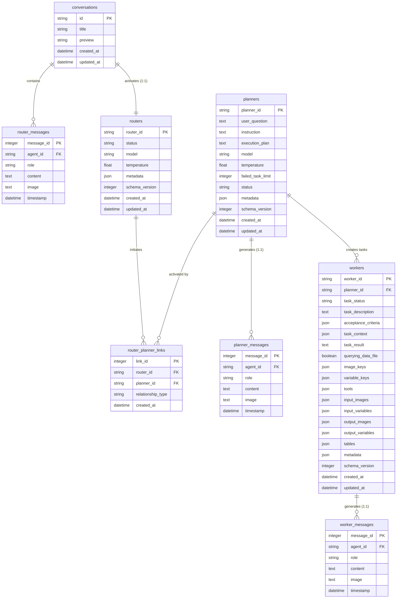
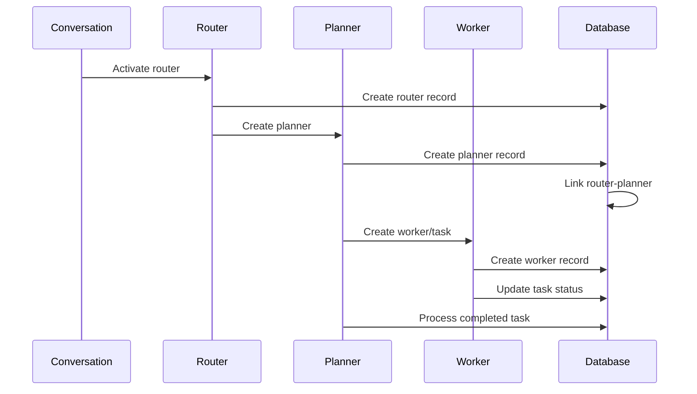
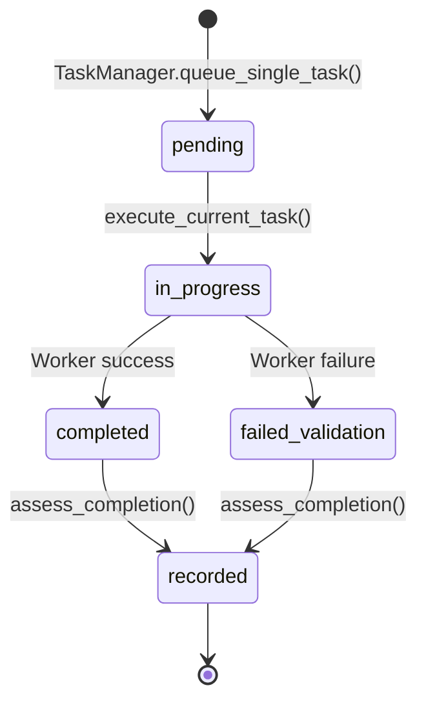

# Entity Relationship Diagram

## Complete Schema Overview



## Relationship Details

### Core Agent Flow
1. **Conversation → Router**: Each conversation activates exactly one router (1:1)
2. **Router → Planner**: Router can initiate multiple planners over time (1:n via link table)
3. **Planner → Worker**: Each planner creates multiple tasks/workers (1:n)

### Message Relationships
Each agent type maintains its own message history:
- **Router Messages**: Conversation-level messaging
- **Planner Messages**: Planning and task management messaging  
- **Worker Messages**: Task execution and result messaging

### Key Constraints

#### Primary Keys
- All agent IDs use 32-character UUID hex strings
- Message IDs use auto-incrementing integers
- Link table uses auto-incrementing link_id

#### Foreign Key Relationships
```sql
-- Core agent relationships
workers.planner_id → planners.planner_id
router_planner_links.router_id → routers.router_id  
router_planner_links.planner_id → planners.planner_id

-- Message relationships
router_messages.agent_id → routers.router_id
planner_messages.agent_id → planners.planner_id
worker_messages.agent_id → workers.worker_id

-- Conversation relationship  
routers.router_id → conversations.id (implicit via same UUID)
```

## Data Flow Patterns

### Agent Lifecycle


### State Persistence
- **Real-time Updates**: Agent properties auto-sync to database via setters
- **Restart Recovery**: Agents can initialise from existing database records
- **Message Continuity**: All conversations preserved across restarts

### Task Management Flow


## Schema Evolution Support

### Version Tracking
- Each table includes `schema_version` field
- Current version tracked in `settings.AGENT_DATABASE_SCHEMA_VERSION`
- Migration system supports gradual transitions

### JSON Flexibility
- Metadata fields allow new attributes without schema changes
- Frequently accessed attributes can be promoted to columns
- Maintains backward compatibility during transitions

---

**Schema Version**: 1.0  
**Last Updated**: 2025-08-06