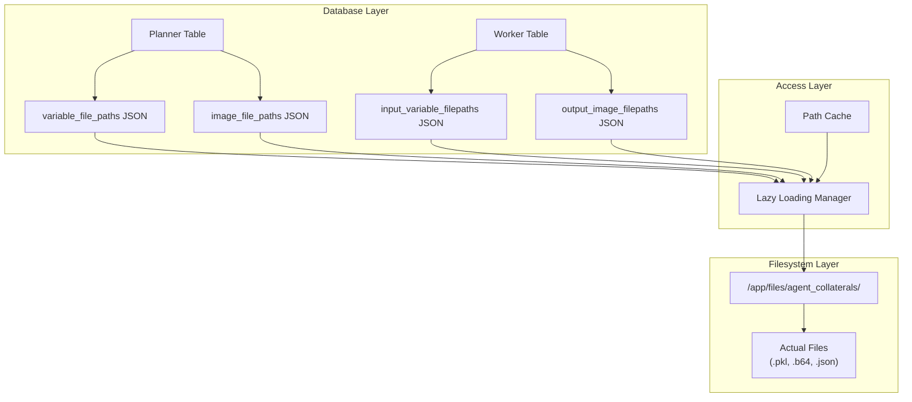

# File Path Storage Patterns

This document details the database patterns for storing file paths in JSON columns, enabling efficient file management without storing large binary data directly in the database.

## Architecture Overview

The file path storage system uses a hybrid approach that separates metadata from content:



## JSON Column Schema Patterns

### Planner Table File Paths

```python
# SQLAlchemy Column Definitions
class Planner(Base):
    __tablename__ = 'planners'
    
    planner_id = Column(String(32), primary_key=True)
    
    # File path storage using JSON columns
    variable_file_paths = Column(JSON, default=lambda: {})  # {key: file_path}
    image_file_paths = Column(JSON, default=lambda: {})     # {key: file_path}
```

#### JSON Structure for Planners

```json
{
  "variable_file_paths": {
    "user_data": "/app/files/agent_collaterals/planner123/variables/user_data.pkl",
    "analysis_results": "/app/files/agent_collaterals/planner123/variables/analysis_results_a3f.pkl",
    "chart_data": "/app/files/agent_collaterals/planner123/variables/chart_data_b72.pkl"
  },
  "image_file_paths": {
    "sales_chart": "/app/files/agent_collaterals/planner123/images/sales_chart.b64",
    "processed_image": "/app/files/agent_collaterals/planner123/images/processed_image_def.b64",
    "final_chart": "/app/files/agent_collaterals/planner123/images/final_chart_912.b64"
  }
}
```

### Worker Table File Paths

Workers use separate input/output columns for better organisation and tracking:

```python
class Worker(Base):
    __tablename__ = 'workers'
    
    worker_id = Column(String(32), primary_key=True)
    planner_id = Column(String(32), ForeignKey('planners.planner_id'))
    
    # Input file paths (inherited from planner)
    input_variable_filepaths = Column(JSON, default=lambda: {})
    input_image_filepaths = Column(JSON, default=lambda: {})
    
    # Output file paths (generated by worker)
    output_variable_filepaths = Column(JSON, default=lambda: {})
    output_image_filepaths = Column(JSON, default=lambda: {})
```

#### JSON Structure for Workers

```json
{
  "input_variable_filepaths": {
    "user_data": "/app/files/agent_collaterals/planner123/variables/user_data.pkl",
    "analysis_context": "/app/files/agent_collaterals/planner123/variables/analysis_context.pkl"
  },
  "input_image_filepaths": {
    "source_chart": "/app/files/agent_collaterals/planner123/images/source_chart.b64"
  },
  "output_variable_filepaths": {
    "processed_data": "/app/files/agent_collaterals/planner123/variables/processed_data_abc.pkl",
    "summary_stats": "/app/files/agent_collaterals/planner123/variables/summary_stats.pkl"
  },
  "output_image_filepaths": {
    "enhanced_chart": "/app/files/agent_collaterals/planner123/images/enhanced_chart_xyz.b64",
    "comparison_plot": "/app/files/agent_collaterals/planner123/images/comparison_plot.b64"
  }
}
```

## Database Operation Patterns

### Incremental Path Updates

File paths are updated incrementally to preserve existing data:

```python
def update_planner_file_paths(
    planner_id: str, 
    variable_paths: dict = None, 
    image_paths: dict = None
) -> bool:
    """
    Update file paths incrementally without losing existing data.
    
    Args:
        planner_id: Target planner identifier
        variable_paths: New variable paths to merge
        image_paths: New image paths to merge
    
    Returns:
        bool: Success status
    """
    try:
        with SessionLocal() as session:
            planner = session.query(Planner).filter(
                Planner.planner_id == planner_id
            ).first()
            
            if not planner:
                logger.error(f"Planner {planner_id} not found")
                return False
            
            # Merge variable paths with existing
            if variable_paths:
                existing_vars = planner.variable_file_paths or {}
                existing_vars.update(variable_paths)
                planner.variable_file_paths = existing_vars
                logger.debug(f"Updated variable paths for {planner_id}: +{len(variable_paths)} paths")
            
            # Merge image paths with existing  
            if image_paths:
                existing_images = planner.image_file_paths or {}
                existing_images.update(image_paths)
                planner.image_file_paths = existing_images
                logger.debug(f"Updated image paths for {planner_id}: +{len(image_paths)} paths")
            
            planner.updated_at = datetime.utcnow()
            session.commit()
            return True
            
    except Exception as e:
        logger.error(f"Failed to update file paths for {planner_id}: {e}")
        return False
```

### Worker Path Inheritance

Workers inherit input paths from their associated planner:

```python
def inherit_planner_files_to_worker(
    worker_id: str, 
    planner_id: str, 
    variable_keys: List[str] = None,
    image_keys: List[str] = None
) -> bool:
    """
    Copy specified file paths from planner to worker as inputs.
    
    Args:
        worker_id: Target worker identifier
        planner_id: Source planner identifier  
        variable_keys: Specific variable keys to inherit (None = all)
        image_keys: Specific image keys to inherit (None = all)
    
    Returns:
        bool: Success status
    """
    try:
        with SessionLocal() as session:
            # Get planner and worker records
            planner = session.query(Planner).filter(
                Planner.planner_id == planner_id
            ).first()
            
            worker = session.query(Worker).filter(
                Worker.worker_id == worker_id
            ).first()
            
            if not planner or not worker:
                logger.error(f"Planner {planner_id} or Worker {worker_id} not found")
                return False
            
            # Inherit variable paths
            planner_vars = planner.variable_file_paths or {}
            if variable_keys:
                # Inherit only specified keys
                inherited_vars = {k: v for k, v in planner_vars.items() if k in variable_keys}
            else:
                # Inherit all variables
                inherited_vars = planner_vars.copy()
            
            worker.input_variable_filepaths = inherited_vars
            
            # Inherit image paths
            planner_images = planner.image_file_paths or {}
            if image_keys:
                # Inherit only specified keys
                inherited_images = {k: v for k, v in planner_images.items() if k in image_keys}
            else:
                # Inherit all images
                inherited_images = planner_images.copy()
            
            worker.input_image_filepaths = inherited_images
            
            worker.updated_at = datetime.utcnow()
            session.commit()
            
            logger.info(f"Worker {worker_id} inherited {len(inherited_vars)} variables and {len(inherited_images)} images from planner {planner_id}")
            return True
            
    except Exception as e:
        logger.error(f"Failed to inherit files from planner {planner_id} to worker {worker_id}: {e}")
        return False
```

### Atomic Path Updates

File path updates happen atomically with file creation:

```python
def save_variable_with_path_update(
    planner_id: str, 
    key: str, 
    value: Any, 
    check_existing: bool = False
) -> tuple[str, str]:
    """
    Save variable and update database path atomically.
    
    Returns:
        tuple: (file_path, final_key_used)
    """
    try:
        # Step 1: Generate collision-safe path
        file_path, final_key = generate_variable_path(planner_id, key, check_existing)
        
        # Step 2: Save to filesystem
        if not save_variable_to_file(file_path, value):
            raise Exception(f"Failed to save variable to {file_path}")
        
        # Step 3: Update database (only if file save succeeded)
        success = update_planner_file_paths(
            planner_id, 
            variable_paths={final_key: file_path}
        )
        
        if not success:
            # Rollback: remove file if database update failed
            try:
                Path(file_path).unlink()
            except:
                pass
            raise Exception(f"Failed to update database paths for {planner_id}")
        
        logger.info(f"Atomically saved variable '{final_key}' for planner {planner_id}")
        return file_path, final_key
        
    except Exception as e:
        logger.error(f"Atomic save failed for variable '{key}' in planner {planner_id}: {e}")
        raise e
```

## Query Patterns

### Path Existence Validation

```python
def validate_file_paths_exist(entity_type: str, entity_id: str) -> dict:
    """
    Validate that all stored file paths actually exist on filesystem.
    
    Args:
        entity_type: 'planner' or 'worker'
        entity_id: Entity identifier
    
    Returns:
        dict: Validation report with missing files
    """
    report = {
        "entity_type": entity_type,
        "entity_id": entity_id,
        "missing_variables": [],
        "missing_images": [],
        "orphaned_paths": []
    }
    
    try:
        with SessionLocal() as session:
            if entity_type == "planner":
                entity = session.query(Planner).filter(
                    Planner.planner_id == entity_id
                ).first()
                
                if entity:
                    # Check variable paths
                    var_paths = entity.variable_file_paths or {}
                    for key, path in var_paths.items():
                        if not Path(path).exists():
                            report["missing_variables"].append({"key": key, "path": path})
                    
                    # Check image paths
                    img_paths = entity.image_file_paths or {}
                    for key, path in img_paths.items():
                        if not Path(path).exists():
                            report["missing_images"].append({"key": key, "path": path})
            
            elif entity_type == "worker":
                entity = session.query(Worker).filter(
                    Worker.worker_id == entity_id
                ).first()
                
                if entity:
                    # Check all four path categories for workers
                    path_categories = [
                        ("input_variables", entity.input_variable_filepaths),
                        ("input_images", entity.input_image_filepaths),
                        ("output_variables", entity.output_variable_filepaths),
                        ("output_images", entity.output_image_filepaths)
                    ]
                    
                    for category, paths in path_categories:
                        paths = paths or {}
                        for key, path in paths.items():
                            if not Path(path).exists():
                                if "variable" in category:
                                    report["missing_variables"].append({
                                        "key": key, 
                                        "path": path, 
                                        "category": category
                                    })
                                else:
                                    report["missing_images"].append({
                                        "key": key, 
                                        "path": path, 
                                        "category": category
                                    })
        
        return report
        
    except Exception as e:
        logger.error(f"Failed to validate file paths for {entity_type} {entity_id}: {e}")
        report["error"] = str(e)
        return report
```

### Path Cleanup Operations

```python
def cleanup_orphaned_paths(entity_type: str, entity_id: str) -> dict:
    """
    Remove file path entries for files that no longer exist.
    
    Returns:
        dict: Cleanup report
    """
    report = {
        "cleaned_variables": [],
        "cleaned_images": [],
        "errors": []
    }
    
    try:
        with SessionLocal() as session:
            if entity_type == "planner":
                entity = session.query(Planner).filter(
                    Planner.planner_id == entity_id
                ).first()
                
                if entity:
                    # Clean variable paths
                    var_paths = entity.variable_file_paths or {}
                    valid_vars = {}
                    
                    for key, path in var_paths.items():
                        if Path(path).exists():
                            valid_vars[key] = path
                        else:
                            report["cleaned_variables"].append({"key": key, "path": path})
                    
                    entity.variable_file_paths = valid_vars
                    
                    # Clean image paths
                    img_paths = entity.image_file_paths or {}
                    valid_imgs = {}
                    
                    for key, path in img_paths.items():
                        if Path(path).exists():
                            valid_imgs[key] = path
                        else:
                            report["cleaned_images"].append({"key": key, "path": path})
                    
                    entity.image_file_paths = valid_imgs
                    entity.updated_at = datetime.utcnow()
            
            session.commit()
            
    except Exception as e:
        logger.error(f"Failed to cleanup orphaned paths for {entity_type} {entity_id}: {e}")
        report["errors"].append(str(e))
    
    return report
```

## JSON Query Optimization

### Database-Level JSON Queries

SQLite provides JSON functions for efficient querying:

```sql
-- Find planners with specific variable keys
SELECT planner_id, variable_file_paths 
FROM planners 
WHERE JSON_EXTRACT(variable_file_paths, '$.analysis_results') IS NOT NULL;

-- Count files per planner
SELECT 
    planner_id,
    JSON_ARRAY_LENGTH(JSON_KEYS(variable_file_paths)) as variable_count,
    JSON_ARRAY_LENGTH(JSON_KEYS(image_file_paths)) as image_count
FROM planners 
WHERE variable_file_paths IS NOT NULL OR image_file_paths IS NOT NULL;

-- Find planners with large numbers of stored files
SELECT planner_id, 
       JSON_ARRAY_LENGTH(JSON_KEYS(variable_file_paths)) + 
       JSON_ARRAY_LENGTH(JSON_KEYS(image_file_paths)) as total_files
FROM planners 
HAVING total_files > 10;
```

### Application-Level JSON Processing

```python
def get_file_statistics(entity_type: str) -> dict:
    """Get file storage statistics across all entities."""
    stats = {
        "total_entities": 0,
        "total_variables": 0,
        "total_images": 0,
        "avg_files_per_entity": 0,
        "entities_with_files": 0
    }
    
    try:
        with SessionLocal() as session:
            if entity_type == "planner":
                entities = session.query(Planner).all()
                
                for entity in entities:
                    stats["total_entities"] += 1
                    
                    var_paths = entity.variable_file_paths or {}
                    img_paths = entity.image_file_paths or {}
                    
                    var_count = len(var_paths)
                    img_count = len(img_paths)
                    
                    stats["total_variables"] += var_count
                    stats["total_images"] += img_count
                    
                    if var_count > 0 or img_count > 0:
                        stats["entities_with_files"] += 1
            
            total_files = stats["total_variables"] + stats["total_images"]
            if stats["total_entities"] > 0:
                stats["avg_files_per_entity"] = total_files / stats["total_entities"]
        
        return stats
        
    except Exception as e:
        logger.error(f"Failed to get file statistics for {entity_type}: {e}")
        return stats
```

## Caching Patterns

### Path Cache Implementation

```python
class FilePathCache:
    """Cache file paths to reduce database queries."""
    
    def __init__(self, ttl_seconds: int = 300):  # 5-minute TTL
        self._cache = {}
        self._timestamps = {}
        self._ttl = ttl_seconds
    
    def _is_expired(self, key: str) -> bool:
        """Check if cache entry has expired."""
        if key not in self._timestamps:
            return True
        return time.time() - self._timestamps[key] > self._ttl
    
    def get_variable_path(self, entity_type: str, entity_id: str, key: str) -> Optional[str]:
        """Get variable path with caching."""
        cache_key = f"{entity_type}:{entity_id}:var:{key}"
        
        # Check cache
        if cache_key in self._cache and not self._is_expired(cache_key):
            return self._cache[cache_key]
        
        # Cache miss - load from database
        path = self._load_variable_path_from_db(entity_type, entity_id, key)
        if path:
            self._cache[cache_key] = path
            self._timestamps[cache_key] = time.time()
        
        return path
    
    def get_image_path(self, entity_type: str, entity_id: str, key: str) -> Optional[str]:
        """Get image path with caching."""
        cache_key = f"{entity_type}:{entity_id}:img:{key}"
        
        # Check cache
        if cache_key in self._cache and not self._is_expired(cache_key):
            return self._cache[cache_key]
        
        # Cache miss - load from database
        path = self._load_image_path_from_db(entity_type, entity_id, key)
        if path:
            self._cache[cache_key] = path
            self._timestamps[cache_key] = time.time()
        
        return path
    
    def invalidate_entity(self, entity_type: str, entity_id: str):
        """Invalidate all cached paths for an entity."""
        prefix = f"{entity_type}:{entity_id}:"
        keys_to_remove = [k for k in self._cache.keys() if k.startswith(prefix)]
        
        for key in keys_to_remove:
            del self._cache[key]
            del self._timestamps[key]
    
    def _load_variable_path_from_db(self, entity_type: str, entity_id: str, key: str) -> Optional[str]:
        """Load variable path directly from database."""
        try:
            with SessionLocal() as session:
                if entity_type == "planner":
                    entity = session.query(Planner).filter(
                        Planner.planner_id == entity_id
                    ).first()
                    
                    if entity and entity.variable_file_paths:
                        return entity.variable_file_paths.get(key)
                
                elif entity_type == "worker":
                    entity = session.query(Worker).filter(
                        Worker.worker_id == entity_id
                    ).first()
                    
                    if entity:
                        # Check both input and output paths
                        input_vars = entity.input_variable_filepaths or {}
                        output_vars = entity.output_variable_filepaths or {}
                        
                        return input_vars.get(key) or output_vars.get(key)
            
            return None
            
        except Exception as e:
            logger.error(f"Failed to load variable path for {entity_type} {entity_id}:{key}: {e}")
            return None

# Global cache instance
_path_cache = FilePathCache()

def get_cached_variable_path(entity_type: str, entity_id: str, key: str) -> Optional[str]:
    """Get variable path using global cache."""
    return _path_cache.get_variable_path(entity_type, entity_id, key)
```

## Migration Patterns

### Path Schema Evolution

```python
def migrate_file_paths_v1_to_v2():
    """Migrate from old path storage to new JSON column format."""
    try:
        with SessionLocal() as session:
            # Get all planners with old format data
            planners = session.query(Planner).all()
            
            for planner in planners:
                needs_update = False
                
                # Migrate old individual columns to JSON (if they existed)
                if hasattr(planner, 'old_variable_paths') and planner.old_variable_paths:
                    # Convert old format to new JSON format
                    old_paths = json.loads(planner.old_variable_paths)
                    planner.variable_file_paths = old_paths
                    needs_update = True
                
                if hasattr(planner, 'old_image_paths') and planner.old_image_paths:
                    old_paths = json.loads(planner.old_image_paths)
                    planner.image_file_paths = old_paths
                    needs_update = True
                
                if needs_update:
                    planner.updated_at = datetime.utcnow()
            
            session.commit()
            logger.info("Successfully migrated file paths to v2 format")
            
    except Exception as e:
        logger.error(f"Failed to migrate file paths: {e}")
        raise e
```

This comprehensive file path storage documentation provides the foundation for efficient, scalable file metadata management throughout the function-based agent system.