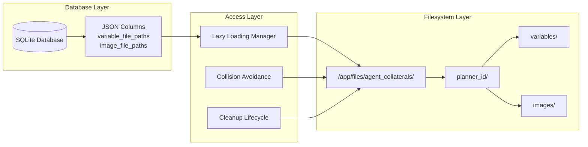

# File Storage Patterns

This document outlines the comprehensive file storage patterns used throughout the agent system, including best practices, collision avoidance strategies, and integration with the database layer.

## Architecture Overview

The file storage system uses a hybrid approach combining database metadata with filesystem storage:



## Directory Structure Patterns

### Base Directory Organisation

```
/app/files/agent_collaterals/
└── {planner_id}/                    # UUID hex string
    ├── variables/                   # Pickle-serialised Python objects
    │   ├── user_data.pkl
    │   ├── analysis_results_a3f.pkl # Collision-avoided with hex suffix
    │   └── chart_data_b72.pkl       # Multiple collision avoidance
    ├── images/                      # Base64 encoded text files
    │   ├── sales_chart.b64
    │   ├── processed_image_def.b64  # Collision-avoided
    │   └── generated_plot.b64
    ├── execution_plan_model.json    # Pydantic ExecutionPlanModel
    └── current_task.json           # Current task state (Task model)
```

### Naming Conventions

#### Variable Files
- **Format**: `{variable_name}.pkl`
- **Serialisation**: Python pickle for object persistence
- **Extensions**: Always `.pkl` for consistency
- **Collision Suffix**: `{variable_name}_{hex}.pkl` (3-char hex)

#### Image Files  
- **Format**: `{cleaned_image_name}.b64`
- **Encoding**: Base64 text files for LLM compatibility
- **Extensions**: Always `.b64` for consistency
- **Name Cleaning**: Alphanumeric + underscores only
- **Collision Suffix**: `{image_name}_{hex}.b64` (3-char hex)

#### Special Files
- **Execution Plan**: `execution_plan_model.json` (fixed name)
- **Current Task**: `current_task.json` (fixed name)
- **Custom Extension**: Based on content type and purpose

## Collision Avoidance Patterns

### Algorithm Overview

The collision avoidance system prevents data loss by generating unique names:

```python
def generate_collision_safe_path(base_name: str, directory: Path, extension: str) -> str:
    """
    Generate a collision-safe file path using hex suffixes.
    
    Algorithm:
    1. Check if base path exists
    2. If exists, generate 3-character hex suffix
    3. Continue until unique path found
    4. Return final path and name
    """
    original_path = directory / f"{base_name}{extension}"
    
    if not original_path.exists():
        return str(original_path), base_name
    
    # Generate suffixes until unique path found
    while True:
        hex_suffix = secrets.token_hex(3)[:3]  # 3-char hex (e.g., "a3f")
        final_name = f"{base_name}_{hex_suffix}"
        new_path = directory / f"{final_name}{extension}"
        
        if not new_path.exists():
            return str(new_path), final_name
```

### Collision Examples

**Variable Collision Sequence:**
```
Original Request: "analysis_results"
1st Save: analysis_results.pkl           → success
2nd Save: analysis_results_a3f.pkl       → collision avoided  
3rd Save: analysis_results_b72.pkl       → collision avoided
4th Save: analysis_results_f1e.pkl       → collision avoided
```

**Image Collision Sequence:**
```
Original Request: "sales_chart"
1st Save: sales_chart.b64               → success
2nd Save: sales_chart_def.b64           → collision avoided
3rd Save: sales_chart_912.b64           → collision avoided
```

### Database Integration

File paths are stored in JSON columns with the collision-resolved names:

```json
{
  "variable_file_paths": {
    "analysis_results": "/app/files/agent_collaterals/planner123/variables/analysis_results.pkl",
    "user_data": "/app/files/agent_collaterals/planner123/variables/user_data_a3f.pkl",
    "final_results": "/app/files/agent_collaterals/planner123/variables/final_results_b72.pkl"
  },
  "image_file_paths": {
    "sales_chart": "/app/files/agent_collaterals/planner123/images/sales_chart.b64",
    "processed_chart": "/app/files/agent_collaterals/planner123/images/processed_chart_def.b64"
  }
}
```

## Image Name Cleaning Patterns

### Cleaning Algorithm

Raw image names undergo comprehensive cleaning before storage:

```python
def clean_image_name(raw_name: str, existing_names: set) -> str:
    """
    Clean and validate image name with comprehensive rules.
    
    Steps:
    1. Replace non-alphanumeric chars with underscores
    2. Remove repeated underscores  
    3. Strip leading/trailing underscores
    4. Fallback to "image" if empty
    5. Handle duplicates with counter
    """
    import re
    
    if not raw_name:
        raw_name = "image"
    
    # Step 1: Replace invalid characters
    cleaned = re.sub(r'[^a-zA-Z0-9_]', '_', raw_name)
    
    # Step 2: Remove repeated underscores
    cleaned = re.sub(r'_+', '_', cleaned)
    
    # Step 3: Strip leading/trailing underscores
    cleaned = cleaned.strip('_')
    
    # Step 4: Fallback if empty
    if not cleaned:
        cleaned = "image"
    
    # Step 5: Handle duplicates
    original_cleaned = cleaned
    counter = 1
    while cleaned in existing_names:
        cleaned = f"{original_cleaned}_{counter}"
        counter += 1
    
    return cleaned
```

### Cleaning Examples

```python
# Input → Output transformations
"Sales Chart (2024).png" → "Sales_Chart_2024"
"user-data & analysis!" → "user_data_analysis"  
"___messy___name___"     → "messy_name"
"123!@#$%^&*()"         → "123"
""                       → "image"
"chart.png"              → "chart"  # Extension removed
"existing_name"          → "existing_name_1"  # Duplicate handling
```

## Lazy Loading Patterns

### Implementation Strategy

Files are only loaded from disk when explicitly requested:

```python
class LazyFileManager:
    def __init__(self, planner_id: str):
        self.planner_id = planner_id
        self._variable_cache = {}
        self._image_cache = {}
    
    def get_variable(self, key: str) -> Any:
        """Lazy load variable with caching."""
        if key not in self._variable_cache:
            # Load from database to get file path
            db = AgentDatabase()
            planner = db.get_planner(self.planner_id)
            variable_paths = planner.get("variable_file_paths", {})
            
            if key in variable_paths:
                # Load from filesystem only when requested
                self._variable_cache[key] = load_variable_from_file(variable_paths[key])
            else:
                return None
        
        return self._variable_cache[key]
```

### Memory Efficiency

**Benefits of Lazy Loading:**
- **Reduced Memory Usage**: Only active variables loaded into memory
- **Faster Startup**: No upfront file loading during planner initialisation
- **Selective Access**: Load only variables needed for current task
- **Cache Management**: Optional caching layer for frequently accessed data

**Usage Patterns:**
```python
# Efficient: Only loads requested variable
user_data = get_planner_variable("planner123", "user_data")

# Inefficient: Loads all variables (avoid in production)
all_variables = get_planner_variables("planner123")  # Use sparingly
```

## Database Storage Patterns

### JSON Column Structure

File paths are stored in structured JSON columns for efficient querying:

#### Planner Table Columns

```python
# SQLAlchemy Column Definitions
variable_file_paths = Column(JSON, default=lambda: {})  # {key: file_path}
image_file_paths = Column(JSON, default=lambda: {})     # {key: file_path}
```

#### Worker Table Columns

Workers use separate input/output columns for better organisation:

```python
# Input file paths (from planner)
input_variable_filepaths = Column(JSON, default=lambda: {})
input_image_filepaths = Column(JSON, default=lambda: {})

# Output file paths (generated by worker)
output_variable_filepaths = Column(JSON, default=lambda: {})  
output_image_filepaths = Column(JSON, default=lambda: {})
```

### Update Patterns

#### Incremental Updates

File paths are updated incrementally to preserve existing data:

```python
def update_planner_file_paths(planner_id: str, variable_paths: dict = None, image_paths: dict = None):
    """Update file paths incrementally without losing existing data."""
    with SessionLocal() as session:
        planner = session.query(Planner).filter(Planner.planner_id == planner_id).first()
        
        if variable_paths:
            existing_vars = planner.variable_file_paths or {}
            existing_vars.update(variable_paths)  # Merge with existing
            planner.variable_file_paths = existing_vars
        
        if image_paths:
            existing_images = planner.image_file_paths or {}
            existing_images.update(image_paths)   # Merge with existing
            planner.image_file_paths = existing_images
        
        session.commit()
```

#### Atomic Operations

File creation and database updates happen atomically:

```python
def save_variable_atomically(planner_id: str, key: str, value: Any) -> tuple[str, str]:
    """Save variable and update database atomically."""
    try:
        # 1. Generate collision-safe path
        file_path, final_key = generate_variable_path(planner_id, key, check_existing=True)
        
        # 2. Save to filesystem
        if not save_variable_to_file(file_path, value):
            raise Exception(f"Failed to save variable to {file_path}")
        
        # 3. Update database (only if file save succeeded)
        db = AgentDatabase()
        planner = db.get_planner(planner_id)
        if planner:
            variable_paths = planner.get("variable_file_paths", {})
            variable_paths[final_key] = file_path
            db.update_planner_file_paths(planner_id, variable_paths=variable_paths)
        
        return file_path, final_key
        
    except Exception as e:
        # Clean up partial state if database update fails
        if Path(file_path).exists():
            Path(file_path).unlink()
        raise e
```

## Cleanup Lifecycle Patterns

### Automatic Cleanup Integration

Cleanup is integrated into the planner lifecycle:

```python
# In execute_synthesis function (planner_tasks.py)
async def execute_synthesis(task_data: Dict[str, Any]):
    """Process worker results and clean up files on completion."""
    # ... synthesis logic ...
    
    # Mark planner as completed
    db.update_planner(planner_id, status="completed", user_response=final_response)
    
    # Clean up planner files since planning is complete
    cleanup_success = cleanup_planner_files(planner_id)
    if cleanup_success:
        logger.info(f"Successfully cleaned up files for completed planner {planner_id}")
    else:
        logger.warning(f"Failed to clean up files for completed planner {planner_id}")
```

### Cleanup Implementation

```python
def cleanup_planner_files(planner_id: str) -> bool:
    """Clean up all files for a completed planner."""
    planner_dir = get_planner_path(planner_id)
    
    if not planner_dir.exists():
        return True  # Already cleaned up
    
    try:
        import shutil
        shutil.rmtree(planner_dir)
        logger.info(f"Cleaned up files for planner {planner_id}")
        return True
    except PermissionError as e:
        logger.error(f"Permission denied cleaning up planner {planner_id}: {e}")
        return False
    except Exception as e:
        logger.error(f"Failed to cleanup files for planner {planner_id}: {e}")
        return False
```

### Selective Cleanup

For debugging or partial cleanup:

```python
def cleanup_variable_files(planner_id: str, variable_keys: list[str]) -> bool:
    """Clean up specific variable files only."""
    db = AgentDatabase()
    planner = db.get_planner(planner_id)
    variable_paths = planner.get("variable_file_paths", {})
    
    for key in variable_keys:
        if key in variable_paths:
            file_path = Path(variable_paths[key])
            if file_path.exists():
                file_path.unlink()
            del variable_paths[key]
    
    # Update database with remaining paths
    db.update_planner_file_paths(planner_id, variable_paths=variable_paths)
    return True
```

## Error Handling Patterns

### File Operation Error Handling

All file operations include comprehensive error handling:

```python
def robust_file_save(file_path: str, content: Any, serialiser_func) -> bool:
    """Save file with comprehensive error handling."""
    try:
        # Ensure parent directory exists
        path = Path(file_path)
        path.parent.mkdir(parents=True, exist_ok=True)
        
        # Save with appropriate serialiser
        with open(path, 'wb' if serialiser_func == pickle.dump else 'w') as f:
            serialiser_func(content, f)
        
        logger.info(f"Successfully saved file: {file_path}")
        return True
        
    except PermissionError as e:
        logger.error(f"Permission denied saving {file_path}: {e}")
        return False
    except OSError as e:
        logger.error(f"OS error saving {file_path}: {e}")
        return False
    except Exception as e:
        logger.error(f"Unexpected error saving {file_path}: {e}")
        return False
```

### Recovery Patterns

When file operations fail, the system provides recovery mechanisms:

```python
def recover_missing_files(planner_id: str) -> dict:
    """Identify and report missing files for a planner."""
    db = AgentDatabase()
    planner = db.get_planner(planner_id)
    
    recovery_report = {
        "missing_variables": [],
        "missing_images": [],
        "orphaned_files": []
    }
    
    # Check for missing variable files
    variable_paths = planner.get("variable_file_paths", {})
    for key, file_path in variable_paths.items():
        if not Path(file_path).exists():
            recovery_report["missing_variables"].append({
                "key": key,
                "expected_path": file_path
            })
    
    # Check for missing image files  
    image_paths = planner.get("image_file_paths", {})
    for key, file_path in image_paths.items():
        if not Path(file_path).exists():
            recovery_report["missing_images"].append({
                "key": key,
                "expected_path": file_path
            })
    
    return recovery_report
```

## Performance Optimisation Patterns

### Batch Operations

For multiple file operations, use batch processing:

```python
def save_multiple_variables(planner_id: str, variables: dict[str, Any]) -> dict[str, str]:
    """Save multiple variables efficiently with single database update."""
    saved_paths = {}
    variable_paths_to_update = {}
    
    # Save all files first
    for key, value in variables.items():
        try:
            file_path, final_key = generate_variable_path(planner_id, key, check_existing=True)
            if save_variable_to_file(file_path, value):
                saved_paths[final_key] = file_path
                variable_paths_to_update[final_key] = file_path
        except Exception as e:
            logger.error(f"Failed to save variable {key}: {e}")
    
    # Single database update for all variables
    if variable_paths_to_update:
        db = AgentDatabase()
        db.update_planner_file_paths(planner_id, variable_paths=variable_paths_to_update)
    
    return saved_paths
```

### Path Caching

Cache frequently accessed paths to reduce database queries:

```python
class PathCache:
    def __init__(self, ttl_seconds: int = 300):  # 5-minute TTL
        self._cache = {}
        self._timestamps = {}
        self._ttl = ttl_seconds
    
    def get_variable_path(self, planner_id: str, key: str) -> Optional[str]:
        """Get variable path with caching."""
        cache_key = f"{planner_id}:{key}"
        
        # Check cache validity
        if cache_key in self._cache:
            if time.time() - self._timestamps[cache_key] < self._ttl:
                return self._cache[cache_key]
        
        # Cache miss or expired - load from database
        db = AgentDatabase()
        planner = db.get_planner(planner_id)
        variable_paths = planner.get("variable_file_paths", {})
        
        if key in variable_paths:
            path = variable_paths[key]
            self._cache[cache_key] = path
            self._timestamps[cache_key] = time.time()
            return path
        
        return None
```

## Testing Patterns

### File Storage Testing

Comprehensive test patterns for file storage operations:

```python
class TestFileStoragePatterns(unittest.TestCase):
    def setUp(self):
        """Set up isolated test environment."""
        self.test_dir = tempfile.mkdtemp()
        self.original_base_path = settings.collaterals_base_path
        settings.collaterals_base_path = self.test_dir
    
    def test_collision_avoidance_sequence(self):
        """Test hex suffix collision avoidance."""
        planner_id = "test_planner_123"
        test_data = {"key": "value"}
        
        # First save should succeed without suffix
        path1, key1 = save_planner_variable(planner_id, "test_var", test_data, check_existing=True)
        self.assertTrue(Path(path1).exists())
        self.assertEqual(key1, "test_var")
        
        # Second save should get hex suffix
        path2, key2 = save_planner_variable(planner_id, "test_var", test_data, check_existing=True)
        self.assertTrue(Path(path2).exists())
        self.assertTrue(key2.startswith("test_var_"))
        self.assertEqual(len(key2), len("test_var_") + 3)  # 3-char hex suffix
    
    def test_lazy_loading_efficiency(self):
        """Test that lazy loading only accesses requested files."""
        planner_id = "test_planner_456"
        
        # Save multiple variables
        save_planner_variable(planner_id, "var1", {"data": 1})
        save_planner_variable(planner_id, "var2", {"data": 2})
        save_planner_variable(planner_id, "var3", {"data": 3})
        
        # Track file access
        access_count = 0
        original_load = load_variable_from_file
        
        def tracking_load(path):
            nonlocal access_count
            access_count += 1
            return original_load(path)
        
        # Replace load function temporarily
        import agent.tasks.file_manager
        agent.tasks.file_manager.load_variable_from_file = tracking_load
        
        try:
            # Only load one variable
            var1 = get_planner_variable(planner_id, "var1")
            
            # Should only access one file
            self.assertEqual(access_count, 1)
            self.assertEqual(var1["data"], 1)
        finally:
            # Restore original function
            agent.tasks.file_manager.load_variable_from_file = original_load
```

This comprehensive file storage pattern documentation provides the foundation for reliable, scalable file management throughout the agent system.