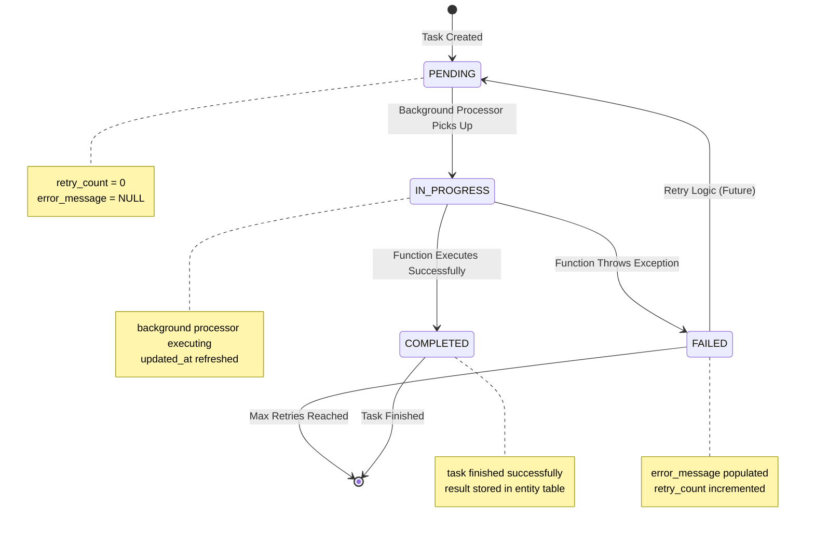

# Task Queue Database Schema

This document details the task queue database schema that enables the function-based architecture, including table constraints, relationships, and operational patterns.

## Overview

The task queue system replaces the class-based agent architecture with a database-driven function execution model. Tasks are queued as database records and executed asynchronously by the background processor.

## Core Schema

### TaskQueue Table

The central table managing all async task execution:

```sql
CREATE TABLE task_queue (
    task_id TEXT PRIMARY KEY,                    -- UUID hex string (unique identifier)
    entity_type TEXT NOT NULL                    -- 'planner' or 'worker'
        CHECK (entity_type IN ('planner', 'worker')),
    entity_id TEXT NOT NULL,                     -- Links to planners/workers table
    function_name TEXT NOT NULL,                 -- Function to execute (registry validation)
    payload JSON,                                -- Function parameters (nullable)
    status TEXT NOT NULL DEFAULT 'PENDING'      -- Task execution status
        CHECK (status IN ('PENDING', 'IN_PROGRESS', 'COMPLETED', 'FAILED')),
    error_message TEXT,                          -- Error details if status = 'FAILED'
    retry_count INTEGER NOT NULL DEFAULT 0      -- Current retry attempt
        CHECK (retry_count >= 0),
    max_retries INTEGER NOT NULL DEFAULT 3      -- Maximum retry attempts
        CHECK (max_retries >= 0),
    created_at TIMESTAMP NOT NULL DEFAULT CURRENT_TIMESTAMP,
    updated_at TIMESTAMP NOT NULL DEFAULT CURRENT_TIMESTAMP
);
```

### Indexes for Performance

```sql
-- Primary access pattern: background processor scanning for pending tasks
CREATE INDEX idx_task_queue_status_created ON task_queue(status, created_at);

-- Entity-based task tracking
CREATE INDEX idx_task_queue_entity ON task_queue(entity_type, entity_id);

-- Function name lookup for debugging
CREATE INDEX idx_task_queue_function ON task_queue(function_name);

-- Status monitoring and cleanup
CREATE INDEX idx_task_queue_status_updated ON task_queue(status, updated_at);
```

### Triggers for Timestamp Management

```sql
-- Automatically update updated_at timestamp
CREATE TRIGGER task_queue_updated_at 
    AFTER UPDATE ON task_queue
    FOR EACH ROW
    WHEN NEW.updated_at = OLD.updated_at
BEGIN
    UPDATE task_queue 
    SET updated_at = CURRENT_TIMESTAMP 
    WHERE task_id = NEW.task_id;
END;
```

## Table Constraints

### Primary Key Constraints

```sql
-- task_id must be unique across all tasks
CONSTRAINT pk_task_queue PRIMARY KEY (task_id)
```

### Check Constraints

#### Entity Type Validation
```sql
-- Only 'planner' and 'worker' entity types allowed
CONSTRAINT chk_entity_type 
    CHECK (entity_type IN ('planner', 'worker'))
```

#### Status Validation  
```sql
-- Enforce valid task status lifecycle
CONSTRAINT chk_status 
    CHECK (status IN ('PENDING', 'IN_PROGRESS', 'COMPLETED', 'FAILED'))
```

#### Retry Count Constraints
```sql
-- Retry count cannot be negative
CONSTRAINT chk_retry_count_positive 
    CHECK (retry_count >= 0)

-- Max retries cannot be negative  
CONSTRAINT chk_max_retries_positive 
    CHECK (max_retries >= 0)

-- Retry count cannot exceed max retries
CONSTRAINT chk_retry_count_within_max 
    CHECK (retry_count <= max_retries)
```

#### Conditional Constraints
```sql
-- Error message required when status is FAILED
CONSTRAINT chk_error_message_on_failure 
    CHECK (
        (status = 'FAILED' AND error_message IS NOT NULL) OR 
        (status != 'FAILED')
    )
```

### Foreign Key Relationships

#### Entity ID References
```sql
-- Dynamic foreign key constraint based on entity_type
-- Note: SQLite doesn't support conditional foreign keys directly
-- This is enforced at the application level

-- For entity_type = 'planner':
--   entity_id REFERENCES planners(planner_id)
-- For entity_type = 'worker':  
--   entity_id REFERENCES workers(worker_id)
```

## Application-Level Constraints

### Function Registry Validation

The background processor validates function names against a registry:

```python
class BackgroundTaskProcessor:
    def __init__(self):
        self.function_registry = {
            # Planner functions
            "execute_initial_planning": planner_tasks.execute_initial_planning,
            "execute_task_creation": planner_tasks.execute_task_creation, 
            "execute_synthesis": planner_tasks.execute_synthesis,
            
            # Worker functions
            "worker_initialisation": worker_tasks.worker_initialisation,
            "execute_standard_worker": worker_tasks.execute_standard_worker,
            "execute_sql_worker": worker_tasks.execute_sql_worker,
        }
    
    def validate_function_name(self, function_name: str) -> bool:
        """Validate function exists in registry."""
        return function_name in self.function_registry
```

### Entity Existence Validation

```python
def validate_entity_exists(entity_type: str, entity_id: str) -> bool:
    """Validate that referenced entity exists in database."""
    db = AgentDatabase()
    
    if entity_type == "planner":
        return db.get_planner(entity_id) is not None
    elif entity_type == "worker":
        return db.get_worker(entity_id) is not None
    
    return False
```

### Payload Validation

```python
def validate_task_payload(function_name: str, payload: dict) -> bool:
    """Validate payload structure for specific function."""
    required_fields = {
        "execute_initial_planning": ["user_question", "instruction"],
        "execute_task_creation": [],  # Uses planner context
        "execute_synthesis": [],      # Uses planner context
        "worker_initialisation": [],  # Uses worker context
        "execute_standard_worker": [], # Uses worker context
        "execute_sql_worker": [],     # Uses worker context
    }
    
    if function_name in required_fields:
        required = required_fields[function_name]
        return all(field in payload for field in required)
    
    return False  # Unknown function
```

## Status Lifecycle Constraints

### Valid State Transitions



### Status Transition Validation

```python
def validate_status_transition(current_status: str, new_status: str) -> bool:
    """Validate status transition is allowed."""
    valid_transitions = {
        "PENDING": ["IN_PROGRESS"],
        "IN_PROGRESS": ["COMPLETED", "FAILED"],
        "FAILED": ["PENDING"],  # For retry logic
        "COMPLETED": [],        # Terminal state
    }
    
    return new_status in valid_transitions.get(current_status, [])
```

## Concurrency Constraints

### Entity-Level Locking

Tasks for the same entity execute sequentially to prevent race conditions:

```python
def get_pending_tasks_with_entity_locking() -> List[Dict[str, Any]]:
    """Get pending tasks ensuring only one per entity."""
    # Get entities currently being processed
    in_progress_entities = set()
    
    with SessionLocal() as session:
        in_progress_tasks = session.query(TaskQueue).filter(
            TaskQueue.status == "IN_PROGRESS"
        ).all()
        
        for task in in_progress_tasks:
            entity_key = f"{task.entity_type}:{task.entity_id}"
            in_progress_entities.add(entity_key)
        
        # Get pending tasks excluding entities already in progress
        pending_tasks = session.query(TaskQueue).filter(
            TaskQueue.status == "PENDING"
        ).order_by(TaskQueue.created_at).all()
        
        available_tasks = []
        for task in pending_tasks:
            entity_key = f"{task.entity_type}:{task.entity_id}"
            if entity_key not in in_progress_entities:
                available_tasks.append(task)
                in_progress_entities.add(entity_key)  # Prevent duplicates
        
        return [task_to_dict(task) for task in available_tasks]
```

### Database Transaction Isolation

```python
def update_task_status_atomically(task_id: str, new_status: str, error_message: str = None):
    """Update task status with proper transaction isolation."""
    with SessionLocal() as session:
        try:
            # Lock row for update
            task = session.query(TaskQueue).filter(
                TaskQueue.task_id == task_id
            ).with_for_update().first()
            
            if not task:
                raise ValueError(f"Task {task_id} not found")
            
            # Validate status transition
            if not validate_status_transition(task.status, new_status):
                raise ValueError(f"Invalid status transition: {task.status} → {new_status}")
            
            # Update fields
            task.status = new_status
            task.updated_at = datetime.utcnow()
            
            if new_status == "FAILED":
                task.error_message = error_message
                task.retry_count += 1
            elif new_status == "COMPLETED":
                task.error_message = None
            
            session.commit()
            
        except Exception as e:
            session.rollback()
            raise e
```

## Retry Logic Constraints

### Retry Count Management

```python
def should_retry_task(task_data: Dict[str, Any]) -> bool:
    """Determine if task should be retried based on constraints."""
    retry_count = task_data.get("retry_count", 0)
    max_retries = task_data.get("max_retries", 3)
    status = task_data.get("status")
    
    # Only retry failed tasks
    if status != "FAILED":
        return False
    
    # Check retry limit
    if retry_count >= max_retries:
        return False
    
    return True

def enqueue_retry(task_id: str) -> bool:
    """Requeue failed task for retry."""
    with SessionLocal() as session:
        task = session.query(TaskQueue).filter(
            TaskQueue.task_id == task_id
        ).first()
        
        if not task or not should_retry_task(task_to_dict(task)):
            return False
        
        # Reset to pending for retry
        task.status = "PENDING"
        task.error_message = None
        task.updated_at = datetime.utcnow()
        # retry_count already incremented during failure
        
        session.commit()
        return True
```

### Exponential Backoff (Future Enhancement)

```python
def calculate_retry_delay(retry_count: int) -> int:
    """Calculate exponential backoff delay in seconds."""
    base_delay = 1  # 1 second base
    max_delay = 300  # 5 minutes maximum
    
    delay = base_delay * (2 ** retry_count)
    return min(delay, max_delay)

# Future schema addition:
# retry_after TIMESTAMP  -- When task is eligible for retry
```

## Monitoring and Cleanup Constraints

### Stale Task Detection

```python
def detect_stale_tasks(threshold_minutes: int = 30) -> List[str]:
    """Detect tasks stuck in IN_PROGRESS state."""
    threshold_time = datetime.utcnow() - timedelta(minutes=threshold_minutes)
    
    with SessionLocal() as session:
        stale_tasks = session.query(TaskQueue).filter(
            TaskQueue.status == "IN_PROGRESS",
            TaskQueue.updated_at < threshold_time
        ).all()
        
        return [task.task_id for task in stale_tasks]

def cleanup_stale_tasks(stale_task_ids: List[str]):
    """Reset stale tasks to PENDING for reprocessing."""
    with SessionLocal() as session:
        session.query(TaskQueue).filter(
            TaskQueue.task_id.in_(stale_task_ids)
        ).update({
            "status": "PENDING",
            "error_message": "Task timed out and was reset",
            "updated_at": datetime.utcnow()
        })
        
        session.commit()
```

### Completed Task Cleanup

```python
def cleanup_completed_tasks(retention_days: int = 7):
    """Remove completed tasks older than retention period."""
    cutoff_date = datetime.utcnow() - timedelta(days=retention_days)
    
    with SessionLocal() as session:
        deleted_count = session.query(TaskQueue).filter(
            TaskQueue.status.in_(["COMPLETED", "FAILED"]),
            TaskQueue.updated_at < cutoff_date
        ).delete()
        
        session.commit()
        return deleted_count
```

## Performance Optimisation Constraints

### Query Patterns

The schema is optimised for the background processor's primary query pattern:

```sql
-- Most frequent query: get pending tasks ordered by creation time
SELECT task_id, entity_type, entity_id, function_name, payload
FROM task_queue 
WHERE status = 'PENDING'
ORDER BY created_at
LIMIT 100;

-- Index: idx_task_queue_status_created covers this query efficiently
```

### Batch Operations

```python
def enqueue_multiple_tasks(tasks: List[Dict[str, Any]]) -> List[str]:
    """Efficiently enqueue multiple tasks in single transaction."""
    task_ids = []
    
    with SessionLocal() as session:
        try:
            for task_data in tasks:
                task_id = str(uuid.uuid4().hex)
                
                task = TaskQueue(
                    task_id=task_id,
                    entity_type=task_data["entity_type"],
                    entity_id=task_data["entity_id"],
                    function_name=task_data["function_name"],
                    payload=task_data.get("payload"),
                    max_retries=task_data.get("max_retries", 3)
                )
                
                session.add(task)
                task_ids.append(task_id)
            
            session.commit()
            return task_ids
            
        except Exception as e:
            session.rollback()
            raise e
```

## Testing Constraints

### Test Data Patterns

```python
class TaskQueueTestCase(unittest.TestCase):
    def test_constraint_violations(self):
        """Test that database constraints are properly enforced."""
        
        # Test invalid entity type
        with self.assertRaises(IntegrityError):
            self.db.enqueue_task(
                task_id="test1",
                entity_type="invalid_type",  # Violates CHECK constraint
                entity_id="entity1",
                function_name="test_function"
            )
        
        # Test invalid status
        with self.assertRaises(IntegrityError):
            task = TaskQueue(
                task_id="test2",
                entity_type="planner",
                entity_id="entity1", 
                function_name="test_function",
                status="INVALID_STATUS"  # Violates CHECK constraint
            )
            self.session.add(task)
            self.session.commit()
        
        # Test negative retry count
        with self.assertRaises(IntegrityError):
            task = TaskQueue(
                task_id="test3",
                entity_type="worker",
                entity_id="entity1",
                function_name="test_function",
                retry_count=-1  # Violates CHECK constraint
            )
            self.session.add(task)
            self.session.commit()
```

This comprehensive schema documentation ensures reliable, performant, and maintainable task queue operations throughout the function-based agent system.